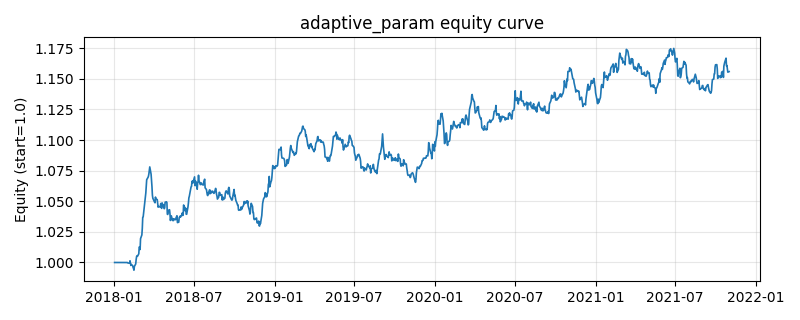

# 策略研究记录：adaptive_param

> 类别/途径：**adaptive** ｜ 类型：timing ｜ 方向：只做多

## 一句话思路
在线自适应参数择时（模块内自实现均线逻辑，不改其它渠道）：以「价格上穿均线做多」为基础逻辑，但均线窗口不再固定——第 t 期用截至 t-1 的 vol_window 期年化已实现波动 σ_{t-1} 在线设定有效窗口 W_t = clip(round(base_window·ref_vol/σ_{t-1}), min_window, max_window)（高波 → 更短窗口、更快响应），敞口同缩放为 clip(target_vol/σ_{t-1}, 0, 1)（高波 → 更低敞口），单资产权重 = 信号(0/1)×敞口/N，逐行和 ≤ 1。变窗口均线用前缀和按格点查表，全向量化。

## 收集途径 / 灵感来源
在线自适应参数 (adaptive parameter / volatility-scaled window) 范式——固定规则的参数随已实现波动状态在线调整；均线择时骨架参考经典趋势跟随，变窗口前缀和实现、参数映射与敞口缩放为本渠道 100% 原创实现（不复用、不修改其它渠道代码）。

## 核心假设
核心假设：最优平滑窗口与波动 regime 相关——高波动期价格信息更快被噪声稀释，更短的窗口能更快跟上趋势转折；同时波动率目标化的敞口把单位时间风险拉平（高波自动降低敞口、低波放大到上限 1）。两者都是对『参数应随环境在线调整』这一自适应思想的直接实现。防未来：σ 面板整体 shift(1)，第 t 期的窗口与敞口参数严格由 ≤t-1 的已实现收益决定；价格与均线比较只用截至 t 的收盘价（引擎还会再滞后一期）。失效场景：波动率跳变时参数调整滞后一期，窗口在临界值附近抖动会放大换手；低波动长趋势中窗口触顶 max_window，均线过于迟钝。

## 参数
- `base_window` = 30
- `min_window` = 8
- `max_window` = 80
- `vol_window` = 21
- `ref_vol` = 0.2
- `target_vol` = 0.15
- `vol_floor` = 0.02

## 实现要点
- 实现文件：`kairos_strategies/channels/adaptive.py`（类名对应本策略）。
- 输出统一为「目标权重面板」(date × asset)，由 `Backtester` 滞后一期执行，杜绝未来函数。
- 仅使用 numpy/pandas，离线、确定性。

## 数据与回测设置
| 项 | 值 |
|---|---|
| 数据集 | synthetic（8 资产） |
| 区间 | 2018-01-02 ~ 2021-11-01 |
| 期数 | 1000 |
| 年化基准期数 | 252 |
| 单边成本率 | 0.0500% |
| 无风险利率 | 0.00% |

## 回测结果
| 指标 | 值 |
|---|---|
| 累计收益 | 15.59% |
| 年化收益 (CAGR) | 3.72% |
| 年化波动 | 4.20% |
| 夏普 | 0.8907 |
| 索提诺 | 1.3166 |
| 最大回撤 | 4.48% |
| 卡玛 | 0.8298 |
| 胜率 | 52.60% |
| 盈利因子 | 1.1584 |
| 平均换手 | 0.0792 |
| 累计换手 | 79.18 |

## 净值曲线

## 结论与改进方向
- 结果为**合成数据上的演示**，用于验证实现正确性与 QR 流程，不构成任何投资建议或收益承诺。
- 改进方向：在真实数据上重跑、参数敏感性分析、加入波动率目标/风控叠加、与其它策略做相关性分散。
