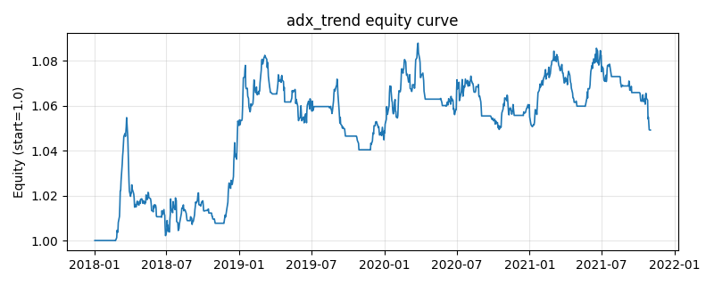

# 策略研究记录：adx_trend

> 类别/途径：**trend** ｜ 类型：timing ｜ 方向：只做多

## 一句话思路
用收盘价近似构造 Wilder DMI/ADX：+DM=max(Δclose,0)、−DM=max(−Δclose,0)，TR=|Δclose|，DI=100×Wilder(DM)/ATR，DX=100×|+DI−(−DI)|/(+DI+(−DI))，ADX=DX 的 Wilder 平滑；仅当 ADX>阈值(趋势够强)且 +DI>−DI(方向向上)时做多，单资产仓位=等预算 1/N，逐行和≤1。

## 收集途径 / 灵感来源
经典 CTA——Wilder ADX/DMI 趋向系统（本仓库以收盘价近似原创实现）。

## 核心假设
核心假设：趋势「强度」可与趋势「方向」分离——ADX 度量方向移动相对总波幅的占比，高 ADX 代表单边行情、低 ADX 代表无方向震荡；只在强趋势且方向向上时持有，可避开震荡市的反复止损。只有收盘价时用价格动能近似 +DI/−DI：单日收盘涨则全部计入 +DM、跌则计入 −DM，ATR 退化为平均绝对价格变动，DX=|平滑(+DM)−平滑(−DM)|/(平滑(+DM)+平滑(−DM))×100 仍是有意义的方向占比度量。失效场景：ADX 高度滞后，趋势启动初期 ADX 仍低而踏空、见顶后才升高而追高；窄幅盘整后突然爆发时反应慢。

## 参数
- `window` = 14
- `adx_min` = 25.0

## 实现要点
- 实现文件：`kairos_strategies/channels/trend.py`（类名对应本策略）。
- 输出统一为「目标权重面板」(date × asset)，由 `Backtester` 滞后一期执行，杜绝未来函数。
- 仅使用 numpy/pandas，离线、确定性。

## 数据与回测设置
| 项 | 值 |
|---|---|
| 数据集 | synthetic（8 资产） |
| 区间 | 2018-01-02 ~ 2021-11-01 |
| 期数 | 1000 |
| 年化基准期数 | 252 |
| 单边成本率 | 0.0500% |
| 无风险利率 | 0.00% |

## 回测结果
| 指标 | 值 |
|---|---|
| 累计收益 | 4.92% |
| 年化收益 (CAGR) | 1.22% |
| 年化波动 | 3.26% |
| 夏普 | 0.3872 |
| 索提诺 | 0.5510 |
| 最大回撤 | 4.99% |
| 卡玛 | 0.2441 |
| 胜率 | 49.04% |
| 盈利因子 | 1.0808 |
| 平均换手 | 0.0249 |
| 累计换手 | 24.94 |

## 净值曲线

## 结论与改进方向
- 结果为 **合成数据演示，用于验证实现正确性与 QR 流程**，不构成任何投资建议或收益承诺。
- 改进方向：在真实数据上重跑、参数敏感性分析、加入波动率目标/风控叠加、与其它策略做相关性分散。
