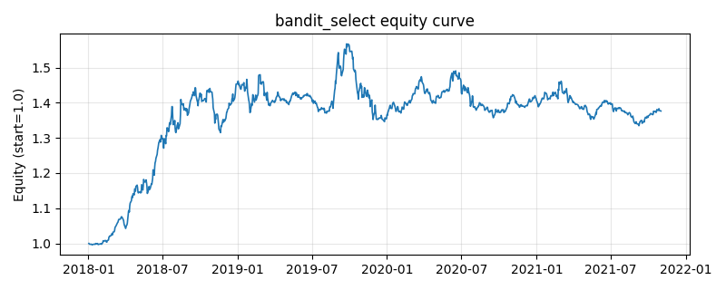

# 策略研究记录：bandit_select

> 类别/途径：**adaptive** ｜ 类型：cross_section ｜ 方向：只做多

## 一句话思路
多臂老虎机在线选择元策略：把 sma_cross、donchian_turtle、rsi_reversion、ts_momentum、tsmom_volscaled、low_volatility、inverse_vol 七个专家当作臂，每 hold 期为一个段，段首用只含 ≤t-1 奖励的滑动窗口 [t-window, t) 计算 UCB1 式分数 = 窗口均值 + explore_c·sqrt(2·ln(段数)/拉动次数)，确定性选中（argmax，并列取池内靠前者）分数最高的专家整段持有其权重面板；预热期等权。

## 收集途径 / 灵感来源
在线学习经典算法——多臂老虎机 UCB1（Auer-Cesa-Bianchi-Fischer 思想）的滑动窗口确定性变体自研实现；专家池复用本仓库其它渠道公开 Strategy 类，奖励由 engine.Backtester 回测产生，无 RNG、并列按池序打破。

## 核心假设
核心假设：与 Hedge 的连续加权不同，bandit 做**离散切换**——每次只押注当前统计意义上最优的单一专家，在市场 regime 分明（某类专家显著占优）时比软加权更锐利、跟得上切换；UCB1 的探索项按拉动次数衰减，保证被冷落的专家仍会被周期性复查，避免在统计噪声上过早锁死（乐观面对不确定性）。滑动窗口均值使统计量只反映近期表现，适应非平稳奖励。防未来：打分只用 [t-window, t) 的已实现奖励，段内不换仓。失效场景：专家表现接近时离散切换制造高换手（每次换臂都是全组合调仓）；窗口过短则均值估计噪声主导、频繁误切换；探索项在专家数少时可能反复拉起真正的差专家。

## 参数
- `window` = 63
- `hold` = 21
- `explore_c` = 0.0002
- `cost_rate` = 0.0
- `n_bases` = 7
- `bases` = ['sma_cross', 'donchian_turtle', 'rsi_reversion', 'ts_momentum', 'tsmom_volscaled', 'low_volatility', 'inverse_vol']

## 实现要点
- 实现文件：`kairos_strategies/channels/adaptive.py`（类名对应本策略）。
- 输出统一为「目标权重面板」(date × asset)，由 `Backtester` 滞后一期执行，杜绝未来函数。
- 仅使用 numpy/pandas，离线、确定性。

## 数据与回测设置
| 项 | 值 |
|---|---|
| 数据集 | synthetic（8 资产） |
| 区间 | 2018-01-02 ~ 2021-11-01 |
| 期数 | 1000 |
| 年化基准期数 | 252 |
| 单边成本率 | 0.0500% |
| 无风险利率 | 0.00% |

## 回测结果
| 指标 | 值 |
|---|---|
| 累计收益 | 37.64% |
| 年化收益 (CAGR) | 8.38% |
| 年化波动 | 10.17% |
| 夏普 | 0.8428 |
| 索提诺 | 1.2859 |
| 最大回撤 | 14.84% |
| 卡玛 | 0.5650 |
| 胜率 | 51.30% |
| 盈利因子 | 1.1659 |
| 平均换手 | 0.1427 |
| 累计换手 | 142.71 |

## 净值曲线

## 结论与改进方向
- 结果为 **合成数据演示，用于验证实现正确性与 QR 流程**，不构成任何投资建议或收益承诺。
- 改进方向：在真实数据上重跑、参数敏感性分析、加入波动率目标/风控叠加、与其它策略做相关性分散。
