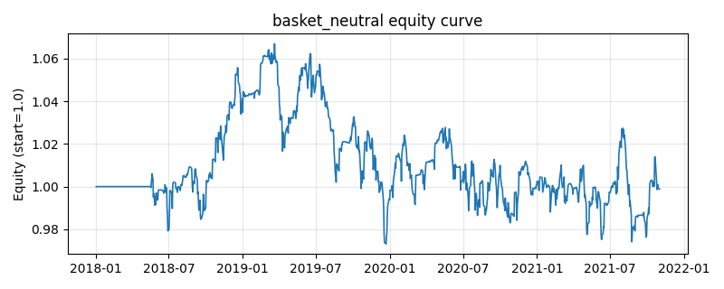

# 策略研究记录：basket_neutral

> 类别/途径：**statarb** ｜ 类型：cross_section ｜ 方向：可多空

## 一句话思路
双篮子相对价值中性：先按尾部已实现波动把资产等分成低波/高波两个结构性篮子（信息不足时退回按列索引奇偶划分），再对两篮子「便宜度」（各资产对数价格相对自身中枢的滚动 z 的篮子均值）之差做滚动 z-score，价差偏贵则做空该篮子、做多另一篮子；篮子内部等权、两篮子各占一半预算，逐行权重和恒为 0。

## 收集途径 / 灵感来源
统计套利经典范式——篮子/板块相对价值多空（basket spread trading、市场中性配对篮子）。本仓库原创实现：篮子划分用尾部已实现波动排名（结构性因子，与交易信号解耦以避免自我循环），信号用两篮子便宜度价差的滚动 z-score；与 meanrev 渠道的单对价差、factor 渠道的只做多排序均不同。

## 核心假设
核心假设：把资产聚成两个风格篮子后，篮子层面的相对估值（贵/便宜）比单资产噪声更稳定，篮子价差围绕中枢波动并会收敛；同时多空两个篮子对冲掉了市场因子，组合对大盘方向中性，只承担「篮子间相对价值」这一维风险。失效场景：两个篮子出现结构性分化（风格切换、低波与高波长期跑赢关系反转）时价差不收敛；篮子划分本身不稳定（波动排名频繁换位）会增加换手与实现偏差。

## 参数
- `vol_window` = 60
- `z_window` = 40
- `spread_window` = 60
- `basket_freq` = 20
- `entry_z` = 1.0
- `exit_z` = 0.25
- `leg_budget` = 0.5

## 实现要点
- 实现文件：`kairos_strategies/channels/statarb.py`（类名对应本策略）。
- 输出统一为「目标权重面板」(date × asset)，由 `Backtester` 滞后一期执行，杜绝未来函数。
- 仅使用 numpy/pandas，离线、确定性。

## 数据与回测设置
| 项 | 值 |
|---|---|
| 数据集 | synthetic（8 资产） |
| 区间 | 2018-01-02 ~ 2021-11-01 |
| 期数 | 1000 |
| 年化基准期数 | 252 |
| 单边成本率 | 0.0500% |
| 无风险利率 | 0.00% |

## 回测结果
| 指标 | 值 |
|---|---|
| 累计收益 | -0.11% |
| 年化收益 (CAGR) | -0.03% |
| 年化波动 | 5.70% |
| 夏普 | 0.0235 |
| 索提诺 | 0.0339 |
| 最大回撤 | 8.80% |
| 卡玛 | -0.0033 |
| 胜率 | 44.52% |
| 盈利因子 | 1.0046 |
| 平均换手 | 0.1825 |
| 累计换手 | 182.53 |

## 净值曲线

## 结论与改进方向
- 结果为**合成数据上的演示**，用于验证实现正确性与 QR 流程，不构成任何投资建议或收益承诺。
- 改进方向：在真实数据上重跑、参数敏感性分析、加入波动率目标/风控叠加、与其它策略做相关性分散。
