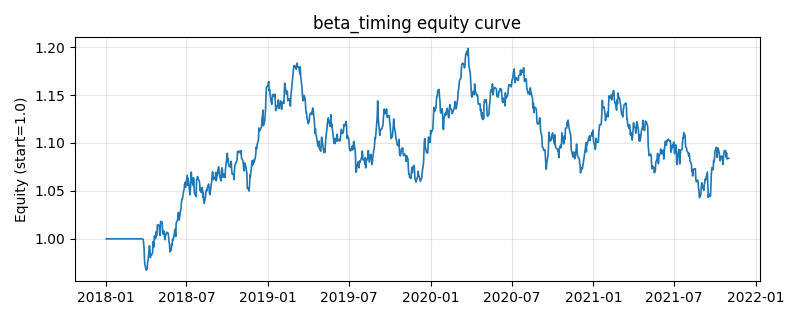

# 策略研究记录：beta_timing

> 类别/途径：**regime** ｜ 类型：timing ｜ 方向：只做多

## 一句话思路
滚动 beta 状态择时：以等权组合为『市场』代理，逐资产滚动 window 期估计 beta（cov/var，仅用历史收益），权重乘数 g = clip(1 + k×(1 − beta), g_min, g_max)——高 beta（高风险状态）资产按比例降敞口、低 beta 资产按比例提高，每资产基础预算 1/N；等权市场的 beta 截面均值恒为 1，故行和天然 ≈ 1，超出 1 的行由 _finalize 等比缩回（组合层 ≤ 1，不加杠杆）。

## 收集途径 / 灵感来源
低 beta 异象 / betting-against-beta 范式的『滚动 beta 预算再分配』择时改写（纯价格收益实现，cov/var 滚动估计与行和恒等式约束为本仓库原创）。

## 核心假设
核心假设：beta 是时变且有持续性的『风险状态』——资产对市场的敏感度升高时，其下行弹性与系统性风险贡献同步升高，而预期收益补偿并不同步升高（低 beta 异象 / betting-against-beta 逻辑），因此按 1−beta 线性重分配预算可改善组合风险调整后收益。行和恒等式（等权 beta 均值 = 1）使该策略是纯『组合内部风险再分配』，不改变总敞口、不做择时赌博。失效场景：高 beta 资产领涨的强牛阶段降配跑输、beta 估计窗口与真实风险状态切换错配（滞后一个窗口）、以及同质化行情中各资产 beta 都贴近 1，乘数失去区分度。

## 参数
- `window` = 60
- `k` = 1.0
- `g_min` = 0.25
- `g_max` = 1.75
- `var_eps` = 1e-16

## 实现要点
- 实现文件：`kairos_strategies/channels/regime.py`（类名对应本策略）。
- 输出统一为「目标权重面板」(date × asset)，由 `Backtester` 滞后一期执行，杜绝未来函数。
- 仅使用 numpy/pandas，离线、确定性。

## 数据与回测设置
| 项 | 值 |
|---|---|
| 数据集 | synthetic（8 资产） |
| 区间 | 2018-01-02 ~ 2021-11-01 |
| 期数 | 1000 |
| 年化基准期数 | 252 |
| 单边成本率 | 0.0500% |
| 无风险利率 | 0.00% |

## 回测结果
| 指标 | 值 |
|---|---|
| 累计收益 | 8.40% |
| 年化收益 (CAGR) | 2.05% |
| 年化波动 | 8.33% |
| 夏普 | 0.2856 |
| 索提诺 | 0.4085 |
| 最大回撤 | 12.99% |
| 卡玛 | 0.1582 |
| 胜率 | 50.27% |
| 盈利因子 | 1.0476 |
| 平均换手 | 0.0407 |
| 累计换手 | 40.69 |

## 净值曲线

## 结论与改进方向
- 结果为**合成数据上的演示**，用于验证实现正确性与 QR 流程，不构成任何投资建议或收益承诺。
- 改进方向：在真实数据上重跑、参数敏感性分析、加入波动率目标/风控叠加、与其它策略做相关性分散。
