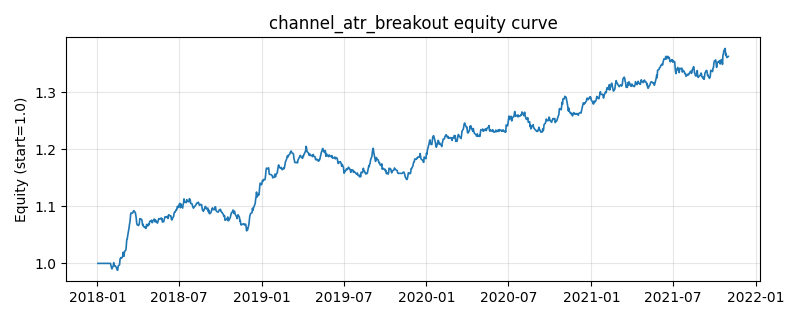

# 策略研究记录：channel_atr_breakout

> 类别/途径：**breakout** ｜ 类型：timing ｜ 方向：只做多

## 一句话思路
通道 + ATR 过滤突破：收盘价突破过去 N 日最高收盘（唐奇安式上轨，滞后一期）且**突破幅度 > k×ATR**（收盘价近似 ATR，滞后一期）才确认做多；跌破过去 M 日最低收盘（退出通道）离场。幅度确认拒绝仅被噪声刺穿上沿的假突破，状态机持有。

## 收集途径 / 灵感来源
经典突破范式——唐奇安通道突破 + 波动自适应幅度确认（本仓库原创实现）。

## 核心假设
核心假设：真突破应伴随「超出常态波幅」的位移——以 ATR 为尺子给突破幅度设门槛，能过滤大部分仅由噪声造成的通道刺穿（假突破的主要形态），代价是入场价更差、漏掉缓慢阴涨型的真突破。进（N 日高点 + 幅度确认）出（M 日低点）双通道构成宽滞后带，显著降低换手。失效场景：波动骤升期门槛随 ATR 抬高导致踏空；长期缓慢上行但从不单日大幅突破的资产会被系统性忽略。

## 参数
- `entry_window` = 20
- `exit_window` = 10
- `atr_window` = 14
- `k` = 0.5
- `atr_floor_pct` = 0.002

## 实现要点
- 实现文件：`kairos_strategies/channels/breakout.py`（类名对应本策略）。
- 输出统一为「目标权重面板」(date × asset)，由 `Backtester` 滞后一期执行，杜绝未来函数。
- 仅使用 numpy/pandas，离线、确定性。

## 数据与回测设置
| 项 | 值 |
|---|---|
| 数据集 | synthetic（8 资产） |
| 区间 | 2018-01-02 ~ 2021-11-01 |
| 期数 | 1000 |
| 年化基准期数 | 252 |
| 单边成本率 | 0.0500% |
| 无风险利率 | 0.00% |

## 回测结果
| 指标 | 值 |
|---|---|
| 累计收益 | 36.33% |
| 年化收益 (CAGR) | 8.12% |
| 年化波动 | 5.15% |
| 夏普 | 1.5409 |
| 索提诺 | 2.4179 |
| 最大回撤 | 5.08% |
| 卡玛 | 1.5978 |
| 胜率 | 51.80% |
| 盈利因子 | 1.2891 |
| 平均换手 | 0.0422 |
| 累计换手 | 42.19 |

## 净值曲线

## 结论与改进方向
- 结果为**合成数据上的演示**，用于验证实现正确性与 QR 流程，不构成任何投资建议或收益承诺。
- 改进方向：在真实数据上重跑、参数敏感性分析、加入波动率目标/风控叠加、与其它策略做相关性分散。
