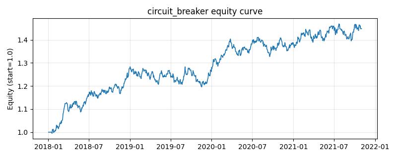

# 策略研究记录：circuit_breaker

> 类别/途径：**riskmgmt** ｜ 类型：overlay ｜ 方向：只做多

## 一句话思路
组合层熔断 overlay：监控等权基准净值的滚动 window 期累计亏损 1 - NAV_t/NAV_{t-window}，一旦 ≥ loss_threshold 立即熔断——当日空仓并进入 cooldown 期强制冷却（全程现金）；冷却结束后若亏损指标已回落到阈值之下则恢复满仓等权，否则再次熔断重新冷却。窗口不足的预热期不建仓。

## 收集途径 / 灵感来源
交易所熔断机制 (circuit breaker) 的组合层移植——滚动亏损触发 + 定时冷却的原创状态机实现。

## 核心假设
核心假设：短期内的急速下跌（恐慌抛售、流动性螺旋）往往需要时间消化，暴跌后立即接回的风险远大于等待——『强制冷静期』把交易者的择时问题变成规则问题，避免在下跌未止时反复抄底。与移动止损的区别：熔断的退出条件是**时间**（冷却期）而非价格（新高），因此恢复更快、代价是可能在下行中继里过早接回（若指标仍超阈值则自动再熔断，形成滚动保护）。失效场景：单日 gap 崩盘（滚动窗口内首末日对比可能低估或高估损失）、V 型反转（冷却期踏空反弹起点）；阈值越小/窗口越短越敏感。

## 参数
- `window` = 10
- `loss_threshold` = 0.08
- `cooldown` = 21

## 实现要点
- 实现文件：`kairos_strategies/channels/riskmgmt.py`（类名对应本策略）。
- 输出统一为「目标权重面板」(date × asset)，由 `Backtester` 滞后一期执行，杜绝未来函数。
- 仅使用 numpy/pandas，离线、确定性。

## 数据与回测设置
| 项 | 值 |
|---|---|
| 数据集 | synthetic（8 资产） |
| 区间 | 2018-01-02 ~ 2021-11-01 |
| 期数 | 1000 |
| 年化基准期数 | 252 |
| 单边成本率 | 0.0500% |
| 无风险利率 | 0.00% |

## 回测结果
| 指标 | 值 |
|---|---|
| 累计收益 | 44.85% |
| 年化收益 (CAGR) | 9.79% |
| 年化波动 | 8.54% |
| 夏普 | 1.1367 |
| 索提诺 | 1.6931 |
| 最大回撤 | 6.80% |
| 卡玛 | 1.4392 |
| 胜率 | 52.53% |
| 盈利因子 | 1.1971 |
| 平均换手 | 0.0119 |
| 累计换手 | 11.90 |

## 净值曲线

## 结论与改进方向
- 结果为 **合成数据演示，用于验证实现正确性与 QR 流程**，不构成任何投资建议或收益承诺。
- 改进方向：在真实数据上重跑、参数敏感性分析、加入波动率目标/风控叠加、与其它策略做相关性分散。
