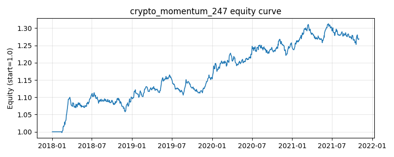

# 策略研究记录：crypto_momentum_247

> 类别/途径：**crypto** ｜ 类型：timing ｜ 方向：只做多

## 一句话思路
24/7 动量：加密市场无休市，用较短窗口（7/30 期）时序动量双确认，做多强势币、空仓弱势币，等预算 1/N。

## 收集途径 / 灵感来源
加密市场实践——24/7 短周期时序动量，本仓库基于价格面板原创实现。

## 核心假设
加密资产 7x24 连续交易、信息消化更快，趋势窗口更短，短周期动量在趋势延续段有效；高噪声震荡期频繁进出会失效。

## 参数
- `fast` = 7
- `slow` = 30

## 实现要点
- 实现文件：`kairos_strategies/channels/crypto.py`（类名对应本策略）。
- 输出统一为「目标权重面板」(date × asset)，由 `Backtester` 滞后一期执行，杜绝未来函数。
- 仅使用 numpy/pandas，离线、确定性。

## 数据与回测设置
| 项 | 值 |
|---|---|
| 数据集 | synthetic（8 资产） |
| 区间 | 2018-01-02 ~ 2021-11-01 |
| 期数 | 1000 |
| 年化基准期数 | 252 |
| 单边成本率 | 0.0500% |
| 无风险利率 | 0.00% |

## 回测结果
| 指标 | 值 |
|---|---|
| 累计收益 | 26.89% |
| 年化收益 (CAGR) | 6.18% |
| 年化波动 | 5.12% |
| 夏普 | 1.1984 |
| 索提诺 | 1.8732 |
| 最大回撤 | 5.03% |
| 卡玛 | 1.2304 |
| 胜率 | 51.51% |
| 盈利因子 | 1.2232 |
| 平均换手 | 0.1140 |
| 累计换手 | 114.03 |

## 净值曲线

## 结论与改进方向
- 结果为**合成数据上的演示**，用于验证实现正确性与 QR 流程，不构成任何投资建议或收益承诺。
- 改进方向：在真实数据上重跑、参数敏感性分析、加入波动率目标/风控叠加、与其它策略做相关性分散。
