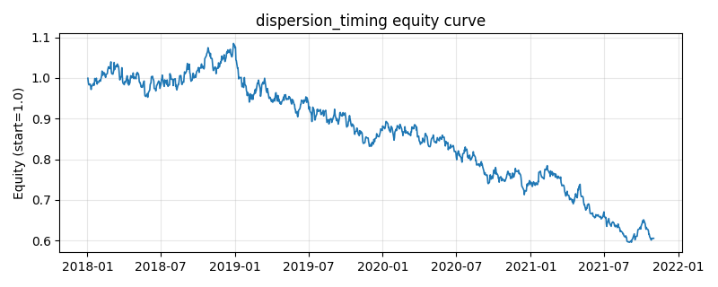

# 策略研究记录：dispersion_timing

> 类别/途径：**dispersion** ｜ 类型：cross_section ｜ 方向：只做多

## 一句话思路
分散度择时：用滚动截面收益分散度（各资产日收益的截面标准差，经平均已实现波动归一为无量纲比率 DR，再线性映射为状态 d ∈ [0,1]）度量市场分化程度——高分散（d → 1，个股走势分化大）时预算倾斜给选股/均值回归腿（按近 rev_window 日收益的截面 z 反向配权，做多相对弱者），低分散（d → 0，齐涨齐跌）时倾斜给指数/趋势腿（时序动量为正的资产等预算 1/N 持有）；两腿按 d 连续混合，预热期（分散度未知）回退等权，行和 ≤ 1、权重 ≥ 0。

## 收集途径 / 灵感来源
指数/单股分散度交易 (dispersion trading) 与适应性市场假说的『状态 × 子策略』范式的纯多头日频概念性适配；截面分散度归一（DR 比率）、两腿构造与连续混合均为本仓库原创实现，与 regime 渠道的状态机切换（ER 判别趋势/震荡）在状态变量与子逻辑上均不同。

## 核心假设
核心假设：截面分散度是『选股能力回报』的度量——分散度越高，资产走势越分化，截面相对定价的信息含量与均值回归强度越大（过度反应更容易在分化环境中被纠正），此时做多相对弱者的截面回归腿占优；分散度极低时资产被同一系统性因子驱动（齐涨齐跌），截面选择没有增益，跟随指数/时序趋势更有效。为什么分散度可度量风险与选股能力：它正是『特质波动占比』的价格侧影像——截面标准差大而个体波动小意味着收益来自可分辨的个体信息而非共同噪声。失效场景：高分散由持续性结构分化（强者恒强的行业行情）驱动时，均值回归腿会持续接刀跑输截面动量；低分散的单边牛市中趋势腿的 0/1 动量开关会频繁进出；分散度状态用自身波动水平归一，波动长期漂移时 DR 的锚会缓慢移动。

## 参数
- `disp_window` = 10
- `vol_window` = 40
- `vol_floor` = 0.01
- `ratio_lo` = 0.3
- `ratio_hi` = 1.0
- `mom_window` = 60
- `rev_window` = 5
- `z_cap` = 2.0

## 实现要点
- 实现文件：`kairos_strategies/channels/dispersion.py`（类名对应本策略）。
- 输出统一为「目标权重面板」(date × asset)，由 `Backtester` 滞后一期执行，杜绝未来函数。
- 仅使用 numpy/pandas，离线、确定性。

## 数据与回测设置
| 项 | 值 |
|---|---|
| 数据集 | synthetic（8 资产） |
| 区间 | 2018-01-02 ~ 2021-11-01 |
| 期数 | 1000 |
| 年化基准期数 | 252 |
| 单边成本率 | 0.0500% |
| 无风险利率 | 0.00% |

## 回测结果
| 指标 | 值 |
|---|---|
| 累计收益 | -39.46% |
| 年化收益 (CAGR) | -11.88% |
| 年化波动 | 13.21% |
| 夏普 | -0.8911 |
| 索提诺 | -1.2028 |
| 最大回撤 | 45.11% |
| 卡玛 | -0.2633 |
| 胜率 | 47.50% |
| 盈利因子 | 0.8696 |
| 平均换手 | 0.5533 |
| 累计换手 | 553.32 |

## 净值曲线

## 结论与改进方向
- 结果为 **合成数据演示，用于验证实现正确性与 QR 流程**，不构成任何投资建议或收益承诺。
- 改进方向：在真实数据上重跑、参数敏感性分析、加入波动率目标/风控叠加、与其它策略做相关性分散。
