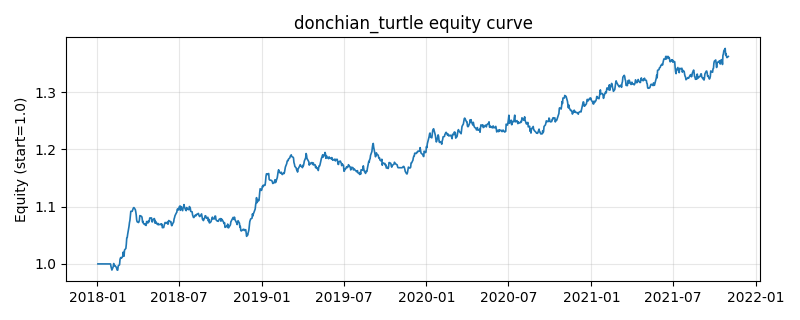

# 策略研究记录：donchian_turtle

> 类别/途径：**technical** ｜ 类型：timing ｜ 方向：只做多

## 一句话思路
唐奇安通道突破（海龟）：创 N 日新高做多，跌破 M 日新低离场。

## 收集途径 / 灵感来源
经典技术分析——唐奇安通道 / 海龟交易法。

## 核心假设
区间突破后趋势延续（海龟交易法则）。

## 参数
- `entry` = 20
- `exit` = 10

## 实现要点
- 实现文件：`kairos_strategies/channels/technical.py`（类名对应本策略）。
- 输出统一为「目标权重面板」(date × asset)，由 `Backtester` 滞后一期执行，杜绝未来函数。
- 仅使用 numpy/pandas，离线、确定性。

## 数据与回测设置
| 项 | 值 |
|---|---|
| 数据集 | synthetic（8 资产） |
| 区间 | 2018-01-02 ~ 2021-11-01 |
| 期数 | 1000 |
| 年化基准期数 | 252 |
| 单边成本率 | 0.0500% |
| 无风险利率 | 0.00% |

## 回测结果
| 指标 | 值 |
|---|---|
| 累计收益 | 36.21% |
| 年化收益 (CAGR) | 8.10% |
| 年化波动 | 5.33% |
| 夏普 | 1.4886 |
| 索提诺 | 2.3166 |
| 最大回撤 | 5.02% |
| 卡玛 | 1.6130 |
| 胜率 | 51.95% |
| 盈利因子 | 1.2761 |
| 平均换手 | 0.0464 |
| 累计换手 | 46.37 |

## 净值曲线

## 结论与改进方向
- 结果为 **合成数据演示，用于验证实现正确性与 QR 流程**，不构成任何投资建议或收益承诺。
- 改进方向：在真实数据上重跑、参数敏感性分析、加入波动率目标/风控叠加、与其它策略做相关性分散。
