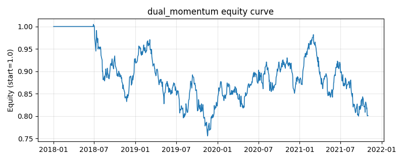

# 策略研究记录：dual_momentum

> 类别/途径：**momentum** ｜ 类型：cross_section ｜ 方向：只做多

## 一句话思路
双动量：绝对动量(自身过去收益>0)过滤 + 相对动量(截面排名靠前)共同决定持有，被选中者等权归一。

## 收集途径 / 灵感来源
动量范式——双动量 dual momentum（Antonacci 思路，原创实现）。

## 核心假设
绝对动量规避下行资产（择大势），相对动量优选最强者，二者结合降低回撤；在动量崩溃/普跌无强势标的时失效。

## 参数
- `lookback` = 126
- `top_frac` = 0.3333333333333333

## 实现要点
- 实现文件：`kairos_strategies/channels/momentum.py`（类名对应本策略）。
- 输出统一为「目标权重面板」(date × asset)，由 `Backtester` 滞后一期执行，杜绝未来函数。
- 仅使用 numpy/pandas，离线、确定性。

## 数据与回测设置
| 项 | 值 |
|---|---|
| 数据集 | synthetic（8 资产） |
| 区间 | 2018-01-02 ~ 2021-11-01 |
| 期数 | 1000 |
| 年化基准期数 | 252 |
| 单边成本率 | 0.0500% |
| 无风险利率 | 0.00% |

## 回测结果
| 指标 | 值 |
|---|---|
| 累计收益 | -19.90% |
| 年化收益 (CAGR) | -5.44% |
| 年化波动 | 12.58% |
| 夏普 | -0.3815 |
| 索提诺 | -0.5327 |
| 最大回撤 | 24.80% |
| 卡玛 | -0.2192 |
| 胜率 | 49.31% |
| 盈利因子 | 0.9368 |
| 平均换手 | 0.1240 |
| 累计换手 | 124.01 |

## 净值曲线

## 结论与改进方向
- 结果为**合成数据上的演示**，用于验证实现正确性与 QR 流程，不构成任何投资建议或收益承诺。
- 改进方向：在真实数据上重跑、参数敏感性分析、加入波动率目标/风控叠加、与其它策略做相关性分散。
