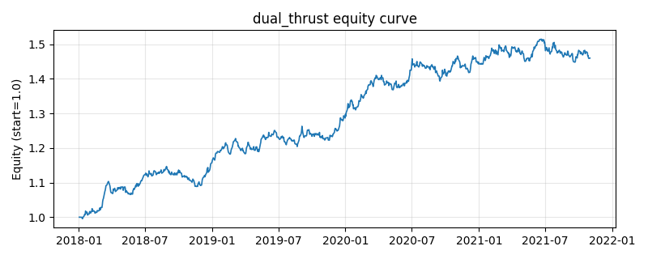

# 策略研究记录：dual_thrust

> 类别/途径：**trend** ｜ 类型：timing ｜ 方向：只做多

## 一句话思路
Dual Thrust：range = 近 N 日 max(HH−LC, HC−LL)（收盘价近似=滚动收盘极差），锚定前一日收盘构造 上轨=anchor+K1×range、下轨=anchor−K2×range（range 用截至昨日的值，防未来）；收盘突破上轨做多、跌破下轨离场，状态机持有，单资产仓位=等预算 1/N，逐行和≤1。

## 收集途径 / 灵感来源
经典 CTA——Dual Thrust 区间突破系统（本仓库以收盘价近似原创实现）。

## 核心假设
核心假设：以近几日真实波幅自适应地设定突破门槛，可在波动放大时抬高门槛过滤噪声、在波动收敛后更易捕捉真突破；Dual Thrust 的非对称上下轨(K1/K2)允许对多空设不同敏感度（本策略 long_only 只用做多侧与离场侧）。只有收盘价时 HH≈HC=滚动最高、LL≈LC=滚动最低，range 退化为滚动收盘极差，当日 open 用前收近似。失效场景：无方向宽幅震荡市中频繁触发上下轨而反复止损(靠偶发大趋势回本)；range 滞后于波动骤升时门槛偏低产生假突破。

## 参数
- `window` = 4
- `k1` = 0.5
- `k2` = 0.5
- `range_floor_pct` = 0.002

## 实现要点
- 实现文件：`kairos_strategies/channels/trend.py`（类名对应本策略）。
- 输出统一为「目标权重面板」(date × asset)，由 `Backtester` 滞后一期执行，杜绝未来函数。
- 仅使用 numpy/pandas，离线、确定性。

## 数据与回测设置
| 项 | 值 |
|---|---|
| 数据集 | synthetic（8 资产） |
| 区间 | 2018-01-02 ~ 2021-11-01 |
| 期数 | 1000 |
| 年化基准期数 | 252 |
| 单边成本率 | 0.0500% |
| 无风险利率 | 0.00% |

## 回测结果
| 指标 | 值 |
|---|---|
| 累计收益 | 45.98% |
| 年化收益 (CAGR) | 10.00% |
| 年化波动 | 6.37% |
| 夏普 | 1.5286 |
| 索提诺 | 2.3270 |
| 最大回撤 | 5.06% |
| 卡玛 | 1.9775 |
| 胜率 | 53.61% |
| 盈利因子 | 1.2785 |
| 平均换手 | 0.1944 |
| 累计换手 | 194.39 |

## 净值曲线

## 结论与改进方向
- 结果为**合成数据上的演示**，用于验证实现正确性与 QR 流程，不构成任何投资建议或收益承诺。
- 改进方向：在真实数据上重跑、参数敏感性分析、加入波动率目标/风控叠加、与其它策略做相关性分散。
