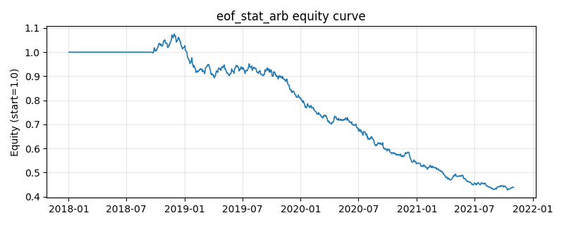

# 策略研究记录：eof_stat_arb

> 类别/途径：**statarb** ｜ 类型：cross_section ｜ 方向：可多空

## 一句话思路
PCA/EOF 统计套利：对截面收益的滚动协方差做 numpy.linalg.eigh 特征分解，取前 m 个主成分构造投影矩阵 P 重构「公允（系统性）收益」，特质残差 u = r - P·r 在 h 日上累计成实际价格相对公允价格的偏离，按自身残差波动标准化后做多被低估(z 低)、做空被高估(z 高)的资产，逐行去均值后为美元中性组合。

## 收集途径 / 灵感来源
Avellaneda & Wei (2010) 的 PCA 统计套利思路（用主成分重构公允价格、对残差做 OU 均值回归）的自研简化版：改为对**收益**（而非对数价格）做滚动 PCA，用「h 日累计残差 / 残差波动」替代 OU 参数估计。特征分解、投影与标准化全部为本仓库原创 numpy 实现，不使用 sklearn/statsmodels。

## 核心假设
核心假设：截面收益的大部分方差由少数共同因子（主成分/EOF）解释，剔除因子后的特质偏离多为流动性冲击与过度反应造成的临时错价，会向因子隐含的公允价格回归，且多空对冲掉因子敞口后风险有限。失效场景：偏离来自真实的特质信息（财报、被并购、退市风险）时会继续扩大；因子结构不稳定或主成分个数选错（m 过大把信号本身当因子吸收、m 过小残留因子敞口）都会显著削弱效果。

## 参数
- `window` = 150
- `n_components` = 2
- `refit_freq` = 5
- `horizon` = 5
- `z_window` = 40
- `z_cap` = 3.0
- `budget` = 1.0

## 实现要点
- 实现文件：`kairos_strategies/channels/statarb.py`（类名对应本策略）。
- 输出统一为「目标权重面板」(date × asset)，由 `Backtester` 滞后一期执行，杜绝未来函数。
- 仅使用 numpy/pandas，离线、确定性。

## 数据与回测设置
| 项 | 值 |
|---|---|
| 数据集 | synthetic（8 资产） |
| 区间 | 2018-01-02 ~ 2021-11-01 |
| 期数 | 1000 |
| 年化基准期数 | 252 |
| 单边成本率 | 0.0500% |
| 无风险利率 | 0.00% |

## 回测结果
| 指标 | 值 |
|---|---|
| 累计收益 | -56.20% |
| 年化收益 (CAGR) | -18.78% |
| 年化波动 | 8.85% |
| 夏普 | -2.3063 |
| 索提诺 | -2.8800 |
| 最大回撤 | 60.22% |
| 卡玛 | -0.3119 |
| 胜率 | 43.10% |
| 盈利因子 | 0.6654 |
| 平均换手 | 0.4678 |
| 累计换手 | 467.83 |

## 净值曲线

## 结论与改进方向
- 结果为**合成数据上的演示**，用于验证实现正确性与 QR 流程，不构成任何投资建议或收益承诺。
- 改进方向：在真实数据上重跑、参数敏感性分析、加入波动率目标/风控叠加、与其它策略做相关性分散。
