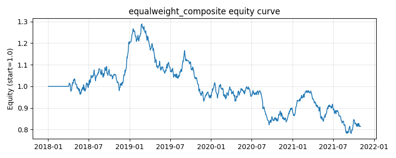

# 策略研究记录：equalweight_composite

> 类别/途径：**multi_factor** ｜ 类型：cross_section ｜ 方向：只做多

## 一句话思路
等权复合因子：动量、低波动、短期反转、趋势质量四个纯价格因子先做截面标准化（z 分数，可选百分位排名），再等权相加成一个复合 alpha，做多复合分最高的约 1/3 篮子，篮子内按秩线性倾斜配权（分数越高权重越大），每行权重和 ≈ 1。

## 收集途径 / 灵感来源
多因子合成最基础的范式——因子等权（equal-weight factor blending），本仓库原创实现；四个基础因子与截面标准化、篮子配权工具均在本模块内自实现。与 factor 渠道的单因子策略（low_volatility / short_term_reversal / trend_quality 各自只用一个分数）、long_short.quality_ls（两成分固定主观权重的多空版）不同，此处是四因子标准化后的等权复合、只做多。

## 核心假设
成因：单一异象各自只捕捉收益截面的一维（信息扩散、彩票偏好、流动性冲击、趋势干净度），噪声大、时灵时不灵；把方向一致的多个弱信号等权相加，各因子的特质噪声在求和中相互抵消，复合分的信噪比与截面区分度高于任何单一成分，且等权不需要估计任何参数，避免了权重估计误差（DeMiguel 的 1/N 稳健性结论在因子层同样成立）。失效条件：几个因子高度相关时等权等于给同一维暴露加倍下注，分散化是假的；因子风格集体逆风（动量崩溃 + 高波反弹同时发生）时四路信号同向亏损；等权对量纲/分布异常敏感（已用截面标准化缓解），且在因子有效性差异悬殊时明显劣于按 IC/IR 加权。

## 参数
- `mom_window` = 63
- `vol_window` = 21
- `rev_window` = 5
- `qual_window` = 21
- `top_frac` = 0.3333333333333333
- `xs_norm` = z
- `score_lag` = 1
- `n_factors` = 4
- `factor_weight` = 0.25

## 实现要点
- 实现文件：`kairos_strategies/channels/multi_factor.py`（类名对应本策略）。
- 输出统一为「目标权重面板」(date × asset)，由 `Backtester` 滞后一期执行，杜绝未来函数。
- 仅使用 numpy/pandas，离线、确定性。

## 数据与回测设置
| 项 | 值 |
|---|---|
| 数据集 | synthetic（8 资产） |
| 区间 | 2018-01-02 ~ 2021-11-01 |
| 期数 | 1000 |
| 年化基准期数 | 252 |
| 单边成本率 | 0.0500% |
| 无风险利率 | 0.00% |

## 回测结果
| 指标 | 值 |
|---|---|
| 累计收益 | -18.54% |
| 年化收益 (CAGR) | -5.04% |
| 年化波动 | 13.06% |
| 夏普 | -0.3303 |
| 索提诺 | -0.4540 |
| 最大回撤 | 39.34% |
| 卡玛 | -0.1280 |
| 胜率 | 49.89% |
| 盈利因子 | 0.9476 |
| 平均换手 | 0.2959 |
| 累计换手 | 295.94 |

## 净值曲线

## 结论与改进方向
- 结果为**合成数据上的演示**，用于验证实现正确性与 QR 流程，不构成任何投资建议或收益承诺。
- 改进方向：在真实数据上重跑、参数敏感性分析、加入波动率目标/风控叠加、与其它策略做相关性分散。
