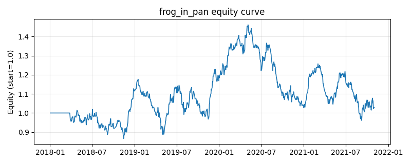

# 策略研究记录：frog_in_pan

> 类别/途径：**momentum_adv** ｜ 类型：cross_section ｜ 方向：只做多

## 一句话思路
温水煮青蛙动量：用过去 N 期「上涨日占比」与收益路径的符号一致性(|Σr|/Σ|r|)度量信息离散度，只做多由许多小涨日平滑累积上涨的资产、规避单日跳空式动量，被选中者截面等权归一（每行和≈1）。

## 收集途径 / 灵感来源
进阶动量变体——Frog-in-the-Pan 信息离散度（Da-Liu-Schaumburg 思路，本仓库原创 numpy/pandas 实现）；与 momentum 渠道的 ts/xs/high_52w/dual（只看涨幅大小）、long_short 渠道的 xs_momentum_ls（多空两端下注）在信号构造上均不同，此处专挑『涨得平滑』。

## 核心假设
针对动量的『路径依赖 / 信息到达方式』缺陷：同样的累计涨幅，若由持续、离散度低的小幅上涨累积而成（青蛙效应），说明信息在逐步扩散、动量更可信也更可持续；若涨幅主要由少数跳空/暴涨贡献（信息离散度高），多为一次性事件驱动、随后极易反转。故做多『平滑上涨』、过滤『跳空动量』能提升动量的稳健性并降低崩溃概率。失效条件：平滑趋势的末端拐点（历史平滑度无法预知反转）、普跌或普涨到无平滑标的可选时信号退化，短窗口下上涨日占比对微观噪声敏感、换手偏高。

## 参数
- `window` = 60
- `top_frac` = 0.3333333333333333
- `min_up_ratio` = 0.5

## 实现要点
- 实现文件：`kairos_strategies/channels/momentum_adv.py`（类名对应本策略）。
- 输出统一为「目标权重面板」(date × asset)，由 `Backtester` 滞后一期执行，杜绝未来函数。
- 仅使用 numpy/pandas，离线、确定性。

## 数据与回测设置
| 项 | 值 |
|---|---|
| 数据集 | synthetic（8 资产） |
| 区间 | 2018-01-02 ~ 2021-11-01 |
| 期数 | 1000 |
| 年化基准期数 | 252 |
| 单边成本率 | 0.0500% |
| 无风险利率 | 0.00% |

## 回测结果
| 指标 | 值 |
|---|---|
| 累计收益 | 2.88% |
| 年化收益 (CAGR) | 0.72% |
| 年化波动 | 19.46% |
| 夏普 | 0.1339 |
| 索提诺 | 0.1920 |
| 最大回撤 | 34.22% |
| 卡玛 | 0.0210 |
| 胜率 | 50.32% |
| 盈利因子 | 1.0227 |
| 平均换手 | 0.3215 |
| 累计换手 | 321.52 |

## 净值曲线

## 结论与改进方向
- 结果为 **合成数据演示，用于验证实现正确性与 QR 流程**，不构成任何投资建议或收益承诺。
- 改进方向：在真实数据上重跑、参数敏感性分析、加入波动率目标/风控叠加、与其它策略做相关性分散。
