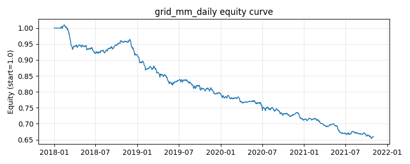

# 策略研究记录：grid_mm_daily

> 类别/途径：**market_making** ｜ 类型：timing ｜ 方向：可多空

## 一句话思路
日频网格做市：围绕滚动参考价（VWAP/均线，每期重新居中）设对数等比网格，价格每下穿一档净库存 +1 份、每上穿一档 −1 份（可转空），库存有界于 [-cap, +cap]；权重=(库存/cap)×(1/N)，行和可不为 0 但有界。与 crypto.grid_trading（固定首价锚、long-only）不同：此处双向、围绕参考价中性。

## 收集途径 / 灵感来源
网格做市（grid market making）实务的日频概念性代理，本仓库原创状态机实现，非真实盘口撮合。与 crypto.grid_trading 的区别：参考价滚动（非锚定首价）、库存双向可空（非 long-only [0,max_steps]）、围绕参考价中性；与 inventory_skew_mm 的区别：库存由「网格档位穿越数」递推而非报价带触发，且无报价偏斜项。

## 核心假设
核心假设：价格围绕滚动的近期成交中枢震荡，网格化「低买高卖」在震荡区间内持续积累库存利润，滚动锚使库存不会因价格中枢漂移而无限累积、净敞口有界且向中性回归。失效场景：单边趋势中价格连续穿越同侧网格，库存被顶在上限（深跌满仓承接 / 急涨过早转空）；日频无真实盘口，「穿档成交」只是收盘价穿越的概念性近似；spacing 相对日波动过宽时成交稀疏、过窄时高频翻转放大换手成本。

## 参数
- `ref_window` = 20
- `spacing` = 0.02
- `cap_steps` = 4

## 实现要点
- 实现文件：`kairos_strategies/channels/market_making.py`（类名对应本策略）。
- 输出统一为「目标权重面板」(date × asset)，由 `Backtester` 滞后一期执行，杜绝未来函数。
- 仅使用 numpy/pandas，离线、确定性。

## 数据与回测设置
| 项 | 值 |
|---|---|
| 数据集 | synthetic（8 资产） |
| 区间 | 2018-01-02 ~ 2021-11-01 |
| 期数 | 1000 |
| 年化基准期数 | 252 |
| 单边成本率 | 0.0500% |
| 无风险利率 | 0.00% |

## 回测结果
| 指标 | 值 |
|---|---|
| 累计收益 | -34.07% |
| 年化收益 (CAGR) | -9.97% |
| 年化波动 | 4.34% |
| 夏普 | -2.3956 |
| 索提诺 | -2.9627 |
| 最大回撤 | 35.26% |
| 卡玛 | -0.2827 |
| 胜率 | 44.34% |
| 盈利因子 | 0.6714 |
| 平均换手 | 0.1402 |
| 累计换手 | 140.16 |

## 净值曲线

## 结论与改进方向
- 结果为 **合成数据演示，用于验证实现正确性与 QR 流程**，不构成任何投资建议或收益承诺。
- 改进方向：在真实数据上重跑、参数敏感性分析、加入波动率目标/风控叠加、与其它策略做相关性分散。
