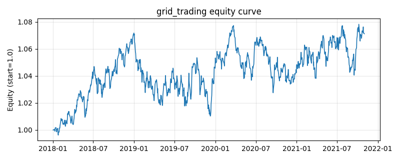

# 策略研究记录：grid_trading

> 类别/途径：**crypto** ｜ 类型：timing ｜ 方向：只做多

## 一句话思路
网格交易：以首个有效价为参考价、按等比间距划档，价格每下穿一档加一份仓位、每上穿一档减一份，仓位在 [0,1] 内阶梯变化（状态机维护当前档位）。

## 收集途径 / 灵感来源
加密市场实践——网格交易 (grid trading)，本仓库基于价格面板原创实现。

## 核心假设
加密市场高波动、宽震荡，网格化『低买高卖』能在区间内持续积累低位筹码；单边急涨时过早清空仓位、单边深跌时满仓承接是主要失效场景。

## 参数
- `spacing` = 0.04
- `max_steps` = 5

## 实现要点
- 实现文件：`kairos_strategies/channels/crypto.py`（类名对应本策略）。
- 输出统一为「目标权重面板」(date × asset)，由 `Backtester` 滞后一期执行，杜绝未来函数。
- 仅使用 numpy/pandas，离线、确定性。

## 数据与回测设置
| 项 | 值 |
|---|---|
| 数据集 | synthetic（8 资产） |
| 区间 | 2018-01-02 ~ 2021-11-01 |
| 期数 | 1000 |
| 年化基准期数 | 252 |
| 单边成本率 | 0.0500% |
| 无风险利率 | 0.00% |

## 回测结果
| 指标 | 值 |
|---|---|
| 累计收益 | 7.12% |
| 年化收益 (CAGR) | 1.75% |
| 年化波动 | 4.61% |
| 夏普 | 0.3991 |
| 索提诺 | 0.5770 |
| 最大回撤 | 5.73% |
| 卡玛 | 0.3050 |
| 胜率 | 50.40% |
| 盈利因子 | 1.0670 |
| 平均换手 | 0.0582 |
| 累计换手 | 58.18 |

## 净值曲线

## 结论与改进方向
- 结果为 **合成数据演示，用于验证实现正确性与 QR 流程**，不构成任何投资建议或收益承诺。
- 改进方向：在真实数据上重跑、参数敏感性分析、加入波动率目标/风控叠加、与其它策略做相关性分散。
