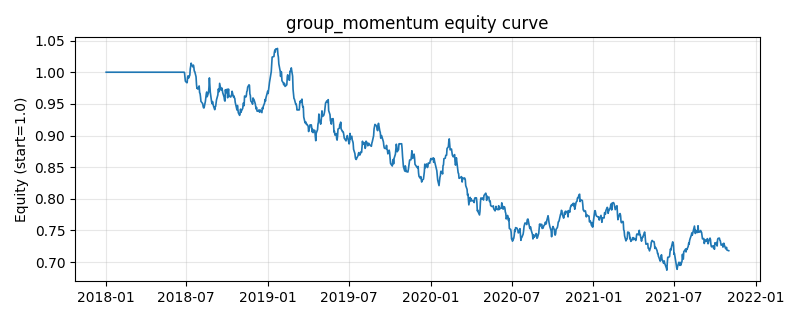

# 策略研究记录：group_momentum

> 类别/途径：**momentum_adv** ｜ 类型：cross_section ｜ 方向：可多空

## 一句话思路
群组动量：按列索引把资产等分为若干连续组，逐日以组内成员截面动量均值给每个组打分，做多最强组、做空最弱组（组内等权），美元中性（行和≈0、绝对值和≤1）。

## 收集途径 / 灵感来源
进阶动量变体——群组/行业动量 (group & industry momentum, Moskowitz-Grinblatt 行业动量思路，本仓库原创实现，用**索引等分**做确定性、可复现、无未来信息的分组)；与个股层面的 xs_momentum_ls（以单只资产为下注单元）不同，此处以**组**为下注单元、组内等权。

## 核心假设
针对个股动量的『噪声 / 特质反转 / 拥挤』缺陷：单只资产的动量易被一次性事件与微观噪声污染，也更容易被拥挤资金抢跑；把动量先聚合到组（板块/群组）层面再排序，能分散掉特质噪声、捕捉更稳健的群组相对强弱，做多最强组、做空最弱组，价差来自群组间而非个股间的基本面/资金分化。失效条件：组间高度同步（相关性骤升、离散度消失）时无强弱可分；固定的索引分组规则若与真实市场结构（行业/风格）错配，会把异质资产混进同组而稀释信号；组数过少则颗粒太粗。

## 参数
- `lookback` = 126
- `skip` = 21
- `n_groups` = 3
- `leg_budget` = 0.5

## 实现要点
- 实现文件：`kairos_strategies/channels/momentum_adv.py`（类名对应本策略）。
- 输出统一为「目标权重面板」(date × asset)，由 `Backtester` 滞后一期执行，杜绝未来函数。
- 仅使用 numpy/pandas，离线、确定性。

## 数据与回测设置
| 项 | 值 |
|---|---|
| 数据集 | synthetic（8 资产） |
| 区间 | 2018-01-02 ~ 2021-11-01 |
| 期数 | 1000 |
| 年化基准期数 | 252 |
| 单边成本率 | 0.0500% |
| 无风险利率 | 0.00% |

## 回测结果
| 指标 | 值 |
|---|---|
| 累计收益 | -28.20% |
| 年化收益 (CAGR) | -8.01% |
| 年化波动 | 10.00% |
| 夏普 | -0.7842 |
| 索提诺 | -1.0648 |
| 最大回撤 | 33.76% |
| 卡玛 | -0.2372 |
| 胜率 | 47.25% |
| 盈利因子 | 0.8757 |
| 平均换手 | 0.0987 |
| 累计换手 | 98.69 |

## 净值曲线

## 结论与改进方向
- 结果为**合成数据上的演示**，用于验证实现正确性与 QR 流程，不构成任何投资建议或收益承诺。
- 改进方向：在真实数据上重跑、参数敏感性分析、加入波动率目标/风控叠加、与其它策略做相关性分散。
