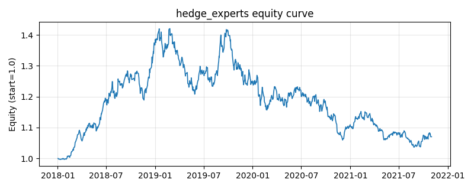

# 策略研究记录：hedge_experts

> 类别/途径：**adaptive** ｜ 类型：cross_section ｜ 方向：只做多

## 一句话思路
Hedge/指数权重在线学习元策略（Freund-Littlestone-Long 自研版）：先用 engine.Backtester 对 sma_cross、donchian_turtle、rsi_reversion、ts_momentum、tsmom_volscaled、low_volatility、inverse_vol 七个专家各做一次零成本回测得到奖励序列，维护每个专家的累计对数收益 G_b（可选 decay<1 折扣旧奖励），第 t 期按 softmax(η·G_b[t-1]) 归一出专家权重并混合其权重面板；η 学习率可调，t=0 等权。

## 收集途径 / 灵感来源
在线学习经典算法——Hedge / 指数权重（Freund-Littlestone-Long 的 multiplicative weights 思想）与折扣 Hedge 变体的自研实现；专家池复用本仓库 technical / momentum / trend / factor / allocation 渠道的公开 Strategy 类，奖励由 engine.Backtester 回测产生。

## 核心假设
核心假设：专家表现存在可被奖励路径追踪的持续性——指数权重把资金按 exp(η·累计对数收益) 倾斜给历史赢家，是乘法权重更新 (MWU) 的经典在线学习算法，对『池中存在长期优秀专家』的情形有遗憾界保证（相对最优单专家的差距随时间收敛）；η 越大对近期表现越敏感、追随越快但噪声越大，decay<1 引入遗忘因子使其在非平稳 regime 切换中更快改押新赢家。防未来：G 整体下移一行，第 t 期权重严格只用 ≤t-1 的已实现奖励。失效场景：专家收益强均值回复（赢家随即变输家）时指数加权系统性追高杀低；η 过大时权重被单期极端奖励主导而剧烈抖动，抬高换手；全部专家同步亏损时它只能『矮子里拔将军』，无法降低总敞口。

## 参数
- `eta` = 8.0
- `decay` = 1.0
- `cost_rate` = 0.0
- `n_bases` = 7
- `bases` = ['sma_cross', 'donchian_turtle', 'rsi_reversion', 'ts_momentum', 'tsmom_volscaled', 'low_volatility', 'inverse_vol']

## 实现要点
- 实现文件：`kairos_strategies/channels/adaptive.py`（类名对应本策略）。
- 输出统一为「目标权重面板」(date × asset)，由 `Backtester` 滞后一期执行，杜绝未来函数。
- 仅使用 numpy/pandas，离线、确定性。

## 数据与回测设置
| 项 | 值 |
|---|---|
| 数据集 | synthetic（8 资产） |
| 区间 | 2018-01-02 ~ 2021-11-01 |
| 期数 | 1000 |
| 年化基准期数 | 252 |
| 单边成本率 | 0.0500% |
| 无风险利率 | 0.00% |

## 回测结果
| 指标 | 值 |
|---|---|
| 累计收益 | 7.01% |
| 年化收益 (CAGR) | 1.72% |
| 年化波动 | 10.76% |
| 夏普 | 0.2125 |
| 索提诺 | 0.2997 |
| 最大回撤 | 27.06% |
| 卡玛 | 0.0637 |
| 胜率 | 51.80% |
| 盈利因子 | 1.0360 |
| 平均换手 | 0.1872 |
| 累计换手 | 187.20 |

## 净值曲线

## 结论与改进方向
- 结果为**合成数据上的演示**，用于验证实现正确性与 QR 流程，不构成任何投资建议或收益承诺。
- 改进方向：在真实数据上重跑、参数敏感性分析、加入波动率目标/风控叠加、与其它策略做相关性分散。
