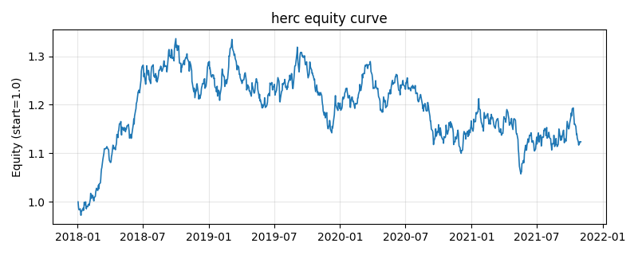

# 策略研究记录：herc

> 类别/途径：**hrp** ｜ 类型：cross_section ｜ 方向：只做多

## 一句话思路
层次等风险贡献(HERC)：滚动相关距离→层次聚类后在树状图上切 k 簇；簇间等权（各 1/k），簇内用自研阻尼乘法定点迭代求等风险贡献(ERC)权重，使簇内各资产风险贡献 wᵢ(Σw)ᵢ 相等，归一到每行和=1。

## 收集途径 / 灵感来源
层次配置经典范式——Hierarchical Equal Risk Contribution（Pozzi 等 HERC 思想的原创实现）；簇内 ERC 用自研乘法定点迭代，scipy 缺失时聚类自动 numpy 回退。

## 核心假设
『先聚类分预算、再簇内均衡风险』把风险平价约束在相关子结构内部，避免全局 ERC 被跨簇共同风险主导；簇间等权不依赖簇数估计的精度，配置更均衡稳健。当簇数 k 与真实相关结构错配、或簇内资产数过少时，退化为近似逆波动率配置。

## 参数
- `window` = 60
- `n_clusters` = 2
- `erc_iters` = 200
- `erc_tol` = 1e-12

## 实现要点
- 实现文件：`kairos_strategies/channels/hrp.py`（类名对应本策略）。
- 输出统一为「目标权重面板」(date × asset)，由 `Backtester` 滞后一期执行，杜绝未来函数。
- 仅使用 numpy/pandas，离线、确定性。

## 数据与回测设置
| 项 | 值 |
|---|---|
| 数据集 | synthetic（8 资产） |
| 区间 | 2018-01-02 ~ 2021-11-01 |
| 期数 | 1000 |
| 年化基准期数 | 252 |
| 单边成本率 | 0.0500% |
| 无风险利率 | 0.00% |

## 回测结果
| 指标 | 值 |
|---|---|
| 累计收益 | 12.35% |
| 年化收益 (CAGR) | 2.98% |
| 年化波动 | 11.49% |
| 夏普 | 0.3127 |
| 索提诺 | 0.4576 |
| 最大回撤 | 20.90% |
| 卡玛 | 0.1425 |
| 胜率 | 50.00% |
| 盈利因子 | 1.0506 |
| 平均换手 | 0.2090 |
| 累计换手 | 209.02 |

## 净值曲线

## 结论与改进方向
- 结果为 **合成数据演示，用于验证实现正确性与 QR 流程**，不构成任何投资建议或收益承诺。
- 改进方向：在真实数据上重跑、参数敏感性分析、加入波动率目标/风控叠加、与其它策略做相关性分散。
