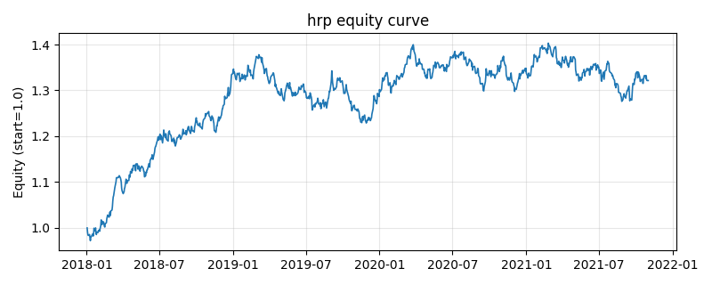

# 策略研究记录：hrp

> 类别/途径：**hrp** ｜ 类型：cross_section ｜ 方向：只做多

## 一句话思路
层次风险平价(HRP)：①相关矩阵→距离 sqrt(0.5(1-ρ))；②层次聚类（scipy single-linkage，缺失回退自研 numpy 凝聚聚类）；③按树状图叶序重排协方差（准对角化）；④递归二分，按簇内逆波动组合方差倒数 α=1-σ²_L/(σ²_L+σ²_R) 分配预算，归一到每行和=1。

## 收集途径 / 灵感来源
层次配置经典范式——Hierarchical Risk Parity（López de Prado 四步思想的原创实现）；聚类用 scipy linkage，缺失时自研 numpy 凝聚聚类回退，全链路确定性。

## 核心假设
把『相关结构聚类』与『风险预算二分』结合，无需矩阵求逆即可利用协方差信息，对估计误差远不如最小方差敏感，在高相关/病态样本下仍给出分散的 long-only 配置。当相关性结构快速切换（危机中簇边界失稳）或窗口过短导致聚类抖动时，权重换手上升、分散化效果打折。

## 参数
- `window` = 60

## 实现要点
- 实现文件：`kairos_strategies/channels/hrp.py`（类名对应本策略）。
- 输出统一为「目标权重面板」(date × asset)，由 `Backtester` 滞后一期执行，杜绝未来函数。
- 仅使用 numpy/pandas，离线、确定性。

## 数据与回测设置
| 项 | 值 |
|---|---|
| 数据集 | synthetic（8 资产） |
| 区间 | 2018-01-02 ~ 2021-11-01 |
| 期数 | 1000 |
| 年化基准期数 | 252 |
| 单边成本率 | 0.0500% |
| 无风险利率 | 0.00% |

## 回测结果
| 指标 | 值 |
|---|---|
| 累计收益 | 32.14% |
| 年化收益 (CAGR) | 7.28% |
| 年化波动 | 8.46% |
| 夏普 | 0.8725 |
| 索提诺 | 1.2890 |
| 最大回撤 | 10.83% |
| 卡玛 | 0.6719 |
| 胜率 | 52.20% |
| 盈利因子 | 1.1478 |
| 平均换手 | 0.0583 |
| 累计换手 | 58.31 |

## 净值曲线

## 结论与改进方向
- 结果为 **合成数据演示，用于验证实现正确性与 QR 流程**，不构成任何投资建议或收益承诺。
- 改进方向：在真实数据上重跑、参数敏感性分析、加入波动率目标/风控叠加、与其它策略做相关性分散。
