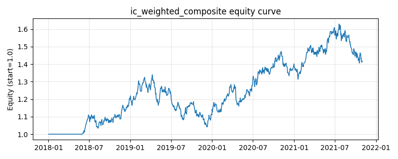

# 策略研究记录：ic_weighted_composite

> 类别/途径：**multi_factor** ｜ 类型：cross_section ｜ 方向：只做多

## 一句话思路
IC 加权复合：对每个基础因子逐日计算它与下一期已实现收益的截面秩相关（Spearman IC），取截至 t−2 的滚动窗口（默认半年）IC 均值作为该因子在第 t 期的复合权重（IC 越高权重越大，IC 为负则给负权反向使用），加权合成复合 alpha 后做多最高的约 1/3 篮子。

## 收集途径 / 灵感来源
多因子合成经典范式——IC 加权（information-coefficient weighting，Grinold-Kahn 的「基本面定律」思路：IR ≈ IC·√breadth，故按 IC 配置因子预算），本仓库原创 numpy/pandas 实现（逐日截面秩相关 + 滞后滚动统计，walk-forward，不用 scipy/sklearn）。与 equalweight_composite 的固定等权不同，权重完全由历史 IC 数据驱动。

## 核心假设
成因：因子有效性随市场风格漂移，历史 IC 是「这个因子最近还能不能预测收益」的直接样本内证据，按 IC 配权等于把预算动态挪到当前有效的因子上，并能自动反向使用已经翻转的因子（负 IC -> 负权），比固定等权更自适应；秩相关对离群值与量纲不敏感，估计相对稳健。失效条件：IC 本身是噪声很大的统计量（半年窗口约 126 个重叠样本、且截面只有几只资产），IC 均值可能只是运气，加权反而放大近期表现最好的因子——在风格急切换处会追高杀低（IC 动量崩溃）；因子间相关性高时 IC 加权会重复计入同一维暴露；样本太短或截面太窄时 IC 估计偏差大，退化为噪声权重。

## 参数
- `mom_window` = 63
- `vol_window` = 21
- `rev_window` = 5
- `qual_window` = 21
- `top_frac` = 0.3333333333333333
- `xs_norm` = z
- `score_lag` = 1
- `label_lag` = 2
- `ic_window` = 126
- `ic_min_obs` = 42
- `ic_min_assets` = 3
- `ic_scheme` = ic
- `ir_std_floor` = 0.02

## 实现要点
- 实现文件：`kairos_strategies/channels/multi_factor.py`（类名对应本策略）。
- 输出统一为「目标权重面板」(date × asset)，由 `Backtester` 滞后一期执行，杜绝未来函数。
- 仅使用 numpy/pandas，离线、确定性。

## 数据与回测设置
| 项 | 值 |
|---|---|
| 数据集 | synthetic（8 资产） |
| 区间 | 2018-01-02 ~ 2021-11-01 |
| 期数 | 1000 |
| 年化基准期数 | 252 |
| 单边成本率 | 0.0500% |
| 无风险利率 | 0.00% |

## 回测结果
| 指标 | 值 |
|---|---|
| 累计收益 | 41.78% |
| 年化收益 (CAGR) | 9.20% |
| 年化波动 | 14.00% |
| 夏普 | 0.6982 |
| 索提诺 | 1.0253 |
| 最大回撤 | 22.22% |
| 卡玛 | 0.4138 |
| 胜率 | 51.90% |
| 盈利因子 | 1.1237 |
| 平均换手 | 0.4343 |
| 累计换手 | 434.26 |

## 净值曲线

## 结论与改进方向
- 结果为 **合成数据演示，用于验证实现正确性与 QR 流程**，不构成任何投资建议或收益承诺。
- 改进方向：在真实数据上重跑、参数敏感性分析、加入波动率目标/风控叠加、与其它策略做相关性分散。
