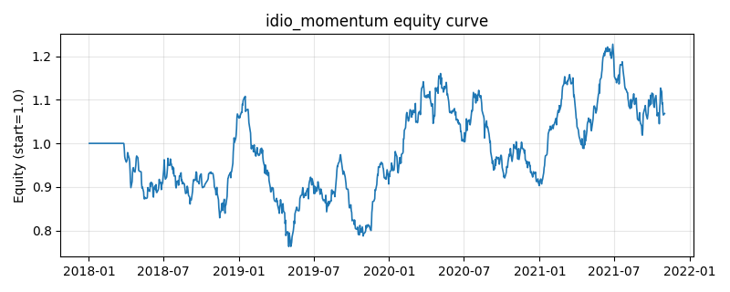

# 策略研究记录：idio_momentum

> 类别/途径：**factor** ｜ 类型：cross_section ｜ 方向：只做多

## 一句话思路
残差动量：用过去收益减去等权市场收益得到相对强度，做多相对强度靠前的一篮子。

## 收集途径 / 灵感来源
因子异象——残差/相对动量 (residual momentum)，纯价格构造。

## 核心假设
剔除等权市场收益后的相对强度更接近资产特质信息的扩散速度，比原始动量更少被市场beta 污染，截面区分度更高、更稳健。当市场剧烈轮动、特质收益被系统性因子主导，或残差动量策略拥挤时，其优势会衰减。

## 参数
- `window` = 60
- `top_frac` = 0.3333333333333333

## 实现要点
- 实现文件：`kairos_strategies/channels/factor.py`（类名对应本策略）。
- 输出统一为「目标权重面板」(date × asset)，由 `Backtester` 滞后一期执行，杜绝未来函数。
- 仅使用 numpy/pandas，离线、确定性。

## 数据与回测设置
| 项 | 值 |
|---|---|
| 数据集 | synthetic（8 资产） |
| 区间 | 2018-01-02 ~ 2021-11-01 |
| 期数 | 1000 |
| 年化基准期数 | 252 |
| 单边成本率 | 0.0500% |
| 无风险利率 | 0.00% |

## 回测结果
| 指标 | 值 |
|---|---|
| 累计收益 | 6.84% |
| 年化收益 (CAGR) | 1.68% |
| 年化波动 | 19.06% |
| 夏普 | 0.1827 |
| 索提诺 | 0.2646 |
| 最大回撤 | 31.09% |
| 卡玛 | 0.0541 |
| 胜率 | 50.96% |
| 盈利因子 | 1.0309 |
| 平均换手 | 0.2593 |
| 累计换手 | 259.32 |

## 净值曲线

## 结论与改进方向
- 结果为**合成数据上的演示**，用于验证实现正确性与 QR 流程，不构成任何投资建议或收益承诺。
- 改进方向：在真实数据上重跑、参数敏感性分析、加入波动率目标/风控叠加、与其它策略做相关性分散。
