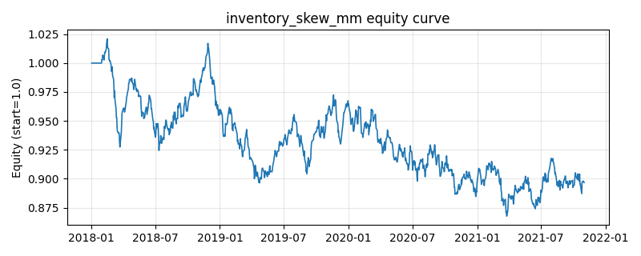

# 策略研究记录：inventory_skew_mm

> 类别/途径：**market_making** ｜ 类型：timing ｜ 方向：可多空

## 一句话思路
库存偏斜做市：维护有界净库存，收盘价低于参考价×(1−band−偏斜) 买入一份加库存、高于参考价×(1+band−偏斜) 卖出一份减库存（可转空）；偏斜 = skew·band·(库存/cap)，多库存时报价带整体下移使其更易卖出，驱动库存均值回归到 0；权重=(库存/cap)×(1/N)，行和可不为 0 但有界。

## 收集途径 / 灵感来源
做市实务中的库存偏斜报价范式（inventory-skew quoting，如 Avellaneda-Stoikov 的报价偏斜思想）的日频概念性代理，本仓库原创状态机实现，非真实盘口撮合。与 crypto.grid_trading（固定首价锚、long-only [0,max_steps]、无库存偏斜）不同：此处参考价滚动、库存双向有界，且报价带随库存偏斜以驱动库存归零。

## 核心假设
核心假设：价格围绕参考价（近期成交中枢）震荡时，「低买高卖」的双边成交能持续积累库存利润，库存偏斜报价保证净敞口有界且自动向 0 回归，风险可控。失效场景：单边行情中价格持续位于报价带同一侧，库存被顶在上限（下跌接飞刀 / 上涨过早转空）；日频无真实盘口，「报价被击中」只是收盘价穿越阈值的概念性近似，赚不到真实价差；band 相对日波动过宽时几乎不成交、过窄时高频翻转。

## 参数
- `ref_window` = 20
- `band` = 0.01
- `skew` = 1.0
- `cap_steps` = 5

## 实现要点
- 实现文件：`kairos_strategies/channels/market_making.py`（类名对应本策略）。
- 输出统一为「目标权重面板」(date × asset)，由 `Backtester` 滞后一期执行，杜绝未来函数。
- 仅使用 numpy/pandas，离线、确定性。

## 数据与回测设置
| 项 | 值 |
|---|---|
| 数据集 | synthetic（8 资产） |
| 区间 | 2018-01-02 ~ 2021-11-01 |
| 期数 | 1000 |
| 年化基准期数 | 252 |
| 单边成本率 | 0.0500% |
| 无风险利率 | 0.00% |

## 回测结果
| 指标 | 值 |
|---|---|
| 累计收益 | -10.32% |
| 年化收益 (CAGR) | -2.71% |
| 年化波动 | 6.60% |
| 夏普 | -0.3830 |
| 索提诺 | -0.5314 |
| 最大回撤 | 15.02% |
| 卡玛 | -0.1803 |
| 胜率 | 49.64% |
| 盈利因子 | 0.9401 |
| 平均换手 | 0.0820 |
| 累计换手 | 82.01 |

## 净值曲线

## 结论与改进方向
- 结果为 **合成数据演示，用于验证实现正确性与 QR 流程**，不构成任何投资建议或收益承诺。
- 改进方向：在真实数据上重跑、参数敏感性分析、加入波动率目标/风控叠加、与其它策略做相关性分散。
