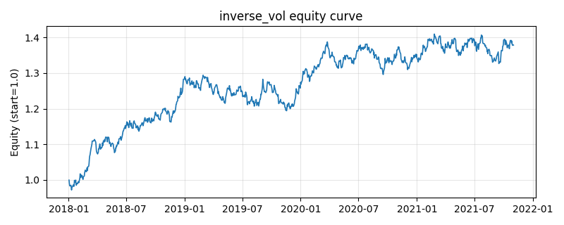

# 策略研究记录：inverse_vol

> 类别/途径：**allocation** ｜ 类型：cross_section ｜ 方向：只做多

## 一句话思路
逆波动率加权：权重 ∝ 1/滚动已实现波动（滚动样本协方差对角线），归一到每行和=1。

## 收集途径 / 灵感来源
组合配置经典范式——逆波动率加权 (inverse volatility weighting)，原创实现。

## 核心假设
波动率的可预测性远强于收益率，按风险倒数分配资金可在不预测收益的前提下压低组合波动、改善夏普。忽略相关性是其近似：当相关性结构剧变、低波资产拥挤或出现尾部跳空时，配置会偏离真正的风险最优。

## 参数
- `window` = 60

## 实现要点
- 实现文件：`kairos_strategies/channels/allocation.py`（类名对应本策略）。
- 输出统一为「目标权重面板」(date × asset)，由 `Backtester` 滞后一期执行，杜绝未来函数。
- 仅使用 numpy/pandas，离线、确定性。

## 数据与回测设置
| 项 | 值 |
|---|---|
| 数据集 | synthetic（8 资产） |
| 区间 | 2018-01-02 ~ 2021-11-01 |
| 期数 | 1000 |
| 年化基准期数 | 252 |
| 单边成本率 | 0.0500% |
| 无风险利率 | 0.00% |

## 回测结果
| 指标 | 值 |
|---|---|
| 累计收益 | 37.87% |
| 年化收益 (CAGR) | 8.43% |
| 年化波动 | 8.39% |
| 夏普 | 1.0069 |
| 索提诺 | 1.4927 |
| 最大回撤 | 7.73% |
| 卡玛 | 1.0906 |
| 胜率 | 52.20% |
| 盈利因子 | 1.1720 |
| 平均换手 | 0.0159 |
| 累计换手 | 15.86 |

## 净值曲线

## 结论与改进方向
- 结果为 **合成数据演示，用于验证实现正确性与 QR 流程**，不构成任何投资建议或收益承诺。
- 改进方向：在真实数据上重跑、参数敏感性分析、加入波动率目标/风控叠加、与其它策略做相关性分散。
