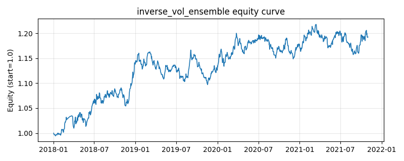

# 策略研究记录：inverse_vol_ensemble

> 类别/途径：**ensemble** ｜ 类型：cross_section ｜ 方向：只做多

## 一句话思路
逆波动元策略（walk-forward）：先用 engine.Backtester 对 sma_cross、donchian_turtle、ts_momentum、low_volatility、inverse_vol 各做一次零成本向量化回测得到策略收益序列，第 t 期按各基础策略「截至 t-1」的 window 期滚动波动倒数（1/σ，σ 设下限 vol_floor）加权，逐行归一到和为 1 后混合其权重面板；观测不足 min_obs 的预热期回退等权。

## 收集途径 / 灵感来源
元策略范式——策略层逆波动率加权（inverse-volatility weighting over strategies），思路来自风险平价/波动率目标；基础策略收益由本仓库 engine.Backtester 回测产生，滚动窗口、shift(1) 的 walk-forward 系数与归一/退化回退为本渠道原创实现。

## 核心假设
核心假设：策略层波动率的可预测性远强于策略层收益率，把更多资金分给近期更平稳的基础策略，能在不预测收益的前提下压低元策略波动、改善夏普（风险平价的策略层版本）；波动下限避免长期空仓（σ→0）的策略获得爆炸性权重。系数由滚动统计再 shift(1) 得到，第 t 期只使用 [0, t-1] 的已实现回测收益，严格防未来。失效场景：波动 regime 切换时历史波动对前瞻波动失去代表性（低波策略恰在波动跳升前重仓）、低波腿本身拥挤，或各基础策略波动接近时退化为近似等权而无增益；它也不区分波动的方向性，高收益高波动策略会被系统性低配。

## 参数
- `weighting` = inverse_vol
- `window` = 126
- `min_obs` = 42
- `vol_floor` = 0.0001
- `cost_rate` = 0.0
- `n_bases` = 5
- `bases` = ['sma_cross', 'donchian_turtle', 'ts_momentum', 'low_volatility', 'inverse_vol']

## 实现要点
- 实现文件：`kairos_strategies/channels/ensemble.py`（类名对应本策略）。
- 输出统一为「目标权重面板」(date × asset)，由 `Backtester` 滞后一期执行，杜绝未来函数。
- 仅使用 numpy/pandas，离线、确定性。

## 数据与回测设置
| 项 | 值 |
|---|---|
| 数据集 | synthetic（8 资产） |
| 区间 | 2018-01-02 ~ 2021-11-01 |
| 期数 | 1000 |
| 年化基准期数 | 252 |
| 单边成本率 | 0.0500% |
| 无风险利率 | 0.00% |

## 回测结果
| 指标 | 值 |
|---|---|
| 累计收益 | 19.27% |
| 年化收益 (CAGR) | 4.54% |
| 年化波动 | 5.70% |
| 夏普 | 0.8072 |
| 索提诺 | 1.1864 |
| 最大回撤 | 5.96% |
| 卡玛 | 0.7625 |
| 胜率 | 52.40% |
| 盈利因子 | 1.1391 |
| 平均换手 | 0.0594 |
| 累计换手 | 59.43 |

## 净值曲线

## 结论与改进方向
- 结果为**合成数据上的演示**，用于验证实现正确性与 QR 流程，不构成任何投资建议或收益承诺。
- 改进方向：在真实数据上重跑、参数敏感性分析、加入波动率目标/风控叠加、与其它策略做相关性分散。
