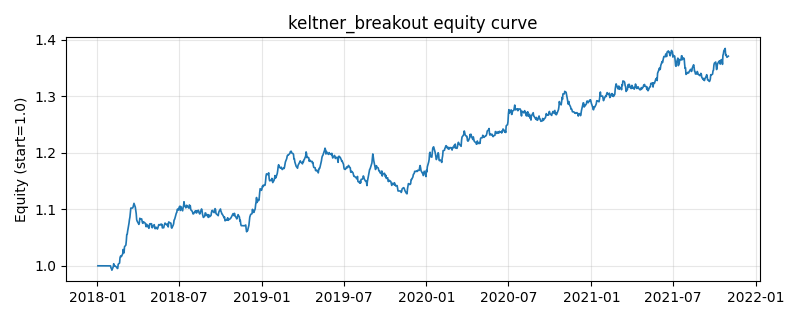

# 策略研究记录：keltner_breakout

> 类别/途径：**breakout** ｜ 类型：timing ｜ 方向：只做多

## 一句话思路
肯特纳通道突破：中轨 = EMA(span)，上/下轨 = EMA ± k×ATR（只有收盘价，ATR 用 |close.diff()| 的 Wilder 平滑近似，即平均绝对价格变动，见模块 docstring）；收盘突破上轨（带 entry_band 缓冲）做多，回落至中轨下方（带 exit_band 缓冲）离场，状态机持有。

## 收集途径 / 灵感来源
经典技术分析——肯特纳通道 (Keltner Channel) 突破范式（本仓库原创实现）。

## 核心假设
核心假设：EMA 中轨 + 波动自适应带宽能刻画「相对近期均衡的异常强势」——收盘站上上轨说明涨速超出近期波动常态，趋势惯性使其大概率延续；跌回 EMA 中轨意味着异常强势消失，及时离场。进/出双缓冲带避免价格在轨道附近抖动导致的频繁换手。失效场景：无方向的高波动震荡市（通道被反复刺穿）；收盘近似 ATR 系统性偏窄，触发比真实高低价通道更频繁；单边急跌后的 V 型反弹会因 EMA 滞后而踏空。

## 参数
- `ema_span` = 20
- `atr_window` = 14
- `k` = 2.0
- `entry_band` = 0.0
- `exit_band` = 0.005
- `atr_floor_pct` = 0.002

## 实现要点
- 实现文件：`kairos_strategies/channels/breakout.py`（类名对应本策略）。
- 输出统一为「目标权重面板」(date × asset)，由 `Backtester` 滞后一期执行，杜绝未来函数。
- 仅使用 numpy/pandas，离线、确定性。

## 数据与回测设置
| 项 | 值 |
|---|---|
| 数据集 | synthetic（8 资产） |
| 区间 | 2018-01-02 ~ 2021-11-01 |
| 期数 | 1000 |
| 年化基准期数 | 252 |
| 单边成本率 | 0.0500% |
| 无风险利率 | 0.00% |

## 回测结果
| 指标 | 值 |
|---|---|
| 累计收益 | 37.07% |
| 年化收益 (CAGR) | 8.27% |
| 年化波动 | 5.60% |
| 夏普 | 1.4471 |
| 索提诺 | 2.2701 |
| 最大回撤 | 6.68% |
| 卡玛 | 1.2387 |
| 胜率 | 52.15% |
| 盈利因子 | 1.2644 |
| 平均换手 | 0.0533 |
| 累计换手 | 53.27 |

## 净值曲线

## 结论与改进方向
- 结果为**合成数据上的演示**，用于验证实现正确性与 QR 流程，不构成任何投资建议或收益承诺。
- 改进方向：在真实数据上重跑、参数敏感性分析、加入波动率目标/风控叠加、与其它策略做相关性分散。
