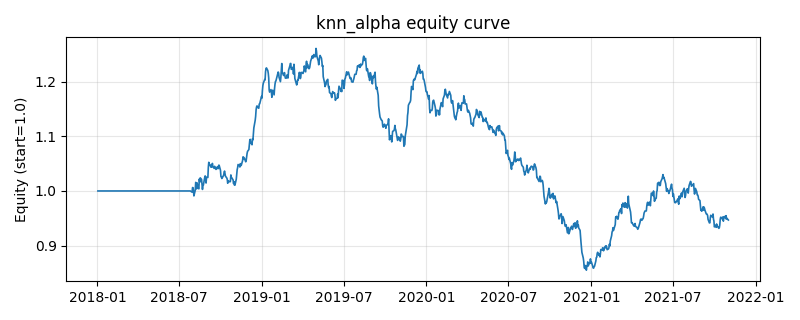

# 策略研究记录：knn_alpha

> 类别/途径：**ml_signal** ｜ 类型：cross_section ｜ 方向：可多空

## 一句话思路
自研 k 近邻回归 walk-forward 预测下期收益：特征按训练集统计标准化后，在滚动 1.5 年样本中寻找与当期特征欧氏距离最近的 k=32 个历史点，用其已实现未来收益的均值作预测，每 21 期重建邻居库；按预测截面去均值做多高分/做空低分（美元中性）。

## 收集途径 / 灵感来源
机器学习范式——k 近邻回归（欧氏距离 + 邻居标签均值，lexsort 确定性打破并列），纯 numpy 自研实现，不使用任何第三方 ML 库。

## 核心假设
「历史会押韵」：动量/波动/RSI 等状态组合相似的历史时点，其后续收益分布也相似（非参数模式匹配，不假设函数形式，天然适应非线性）。当特征维数偏高致距离失去区分度（维数灾难）、市场非平稳使旧邻居不再代表新环境，或k 过小（方差大）/过大（偏差大）时失效。

## 参数
- `k` = 32
- `refit` = 21
- `train_window` = 378
- `min_train_dates` = 126
- `budget` = 1.0

## 实现要点
- 实现文件：`kairos_strategies/channels/ml_signal.py`（类名对应本策略）。
- 输出统一为「目标权重面板」(date × asset)，由 `Backtester` 滞后一期执行，杜绝未来函数。
- 仅使用 numpy/pandas，离线、确定性。

## 数据与回测设置
| 项 | 值 |
|---|---|
| 数据集 | synthetic（8 资产） |
| 区间 | 2018-01-02 ~ 2021-11-01 |
| 期数 | 1000 |
| 年化基准期数 | 252 |
| 单边成本率 | 0.0500% |
| 无风险利率 | 0.00% |

## 回测结果
| 指标 | 值 |
|---|---|
| 累计收益 | -5.32% |
| 年化收益 (CAGR) | -1.37% |
| 年化波动 | 9.48% |
| 夏普 | -0.0979 |
| 索提诺 | -0.1371 |
| 最大回撤 | 32.17% |
| 卡玛 | -0.0425 |
| 胜率 | 50.23% |
| 盈利因子 | 0.9836 |
| 平均换手 | 0.0656 |
| 累计换手 | 65.61 |

## 净值曲线

## 结论与改进方向
- 结果为**合成数据上的演示**，用于验证实现正确性与 QR 流程，不构成任何投资建议或收益承诺。
- 改进方向：在真实数据上重跑、参数敏感性分析、加入波动率目标/风控叠加、与其它策略做相关性分散。
