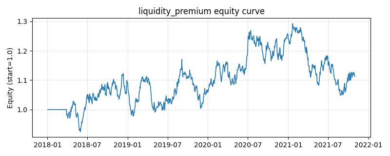

# 策略研究记录：liquidity_premium

> 类别/途径：**microstructure** ｜ 类型：cross_section ｜ 方向：只做多

## 一句话思路
流动性溢价：偏好低流动性/低换手（滚动成交量相对自身均值偏低且截面量能冷清）的资产，做多最非流动篮子。

## 收集途径 / 灵感来源
微观结构/学术因子——流动性溢价（Amihud 非流动性）思想的原创量价实现。

## 核心假设
流动性是资产定价的系统性维度：持有『冷清、难变现』的资产需要补偿，长期看低换手/低量能组合的期望收益高于高流动性组合（Amihud 式非流动性溢价）；同时量能相对自身均值萎缩往往处于关注度低谷，后续关注度修复带来超额收益。当流动性危机中非流动资产折价加剧且无法变现、或溢价被拥挤套利压缩时，策略会失效。

## 参数
- `fast` = 10
- `slow` = 60
- `top_frac` = 0.3333333333333333

## 实现要点
- 实现文件：`kairos_strategies/channels/microstructure.py`（类名对应本策略）。
- 输出统一为「目标权重面板」(date × asset)，由 `Backtester` 滞后一期执行，杜绝未来函数。
- 仅使用 numpy/pandas，离线、确定性。

## 数据与回测设置
| 项 | 值 |
|---|---|
| 数据集 | synthetic（8 资产） |
| 区间 | 2018-01-02 ~ 2021-11-01 |
| 期数 | 1000 |
| 年化基准期数 | 252 |
| 单边成本率 | 0.0500% |
| 无风险利率 | 0.00% |

## 回测结果
| 指标 | 值 |
|---|---|
| 累计收益 | 11.31% |
| 年化收益 (CAGR) | 2.74% |
| 年化波动 | 13.10% |
| 夏普 | 0.2716 |
| 索提诺 | 0.3894 |
| 最大回撤 | 18.88% |
| 卡玛 | 0.1450 |
| 胜率 | 49.42% |
| 盈利因子 | 1.0454 |
| 平均换手 | 0.4414 |
| 累计换手 | 441.39 |

## 净值曲线

## 结论与改进方向
- 结果为**合成数据上的演示**，用于验证实现正确性与 QR 流程，不构成任何投资建议或收益承诺。
- 改进方向：在真实数据上重跑、参数敏感性分析、加入波动率目标/风控叠加、与其它策略做相关性分散。
