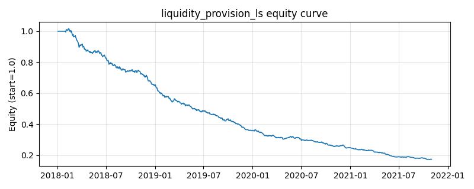

# 策略研究记录：liquidity_provision_ls

> 类别/途径：**market_making** ｜ 类型：cross_section ｜ 方向：可多空

## 一句话思路
流动性提供多空：对 1~3 期极短收益取每期平均并按自身日波动标准化得到冲击强度，做多短期急跌（流动性冲击的买方对手盘）、做空短期急涨（卖方对手盘），逐行去均值构成美元中性组合（行和 ≈ 0），每行绝对值和 ≤ 1。

## 收集途径 / 灵感来源
做市/流动性提供理论（为订单流冲击提供对手盘、赚取流动性溢价）的日频截面代理，本仓库原创实现。与 long_short.reversal_ls（lookback 5、top/bottom 分位篮子等权）、statarb.xs_zscore_reversion（lookback 10、截面 z + 平滑）、factor.short_term_reversal（只做多）不同：此处 horizon 仅 1~3 期、按时序波动标准化成「冲击强度（几个日 σ）」、连续配权 + 截断 + 逐行去均值，语义是流动性提供而非纯反转因子。

## 核心假设
核心假设：极短窗口（1~3 期）的价格变动中流动性冲击（被动抛压/抢购、止损盘）占比最高，冲击造成的临时错价随后回补，站在冲击对面提供流动性可获得近似做市价差的补偿；美元中性对冲掉市场方向，收益来源是截面冲击离散度。失效场景：短期涨跌由真实信息驱动（业绩爆雷/利好兑现）时跌者继续跌、涨者继续涨，「对手盘」变成接飞刀；horizon 极短、换手高，交易成本可能吞掉毛收益；危机期流动性螺旋中冲击持续同向放大。

## 参数
- `horizons` = (1, 2, 3)
- `sigma_window` = 20
- `z_cap` = 3.0
- `budget` = 1.0

## 实现要点
- 实现文件：`kairos_strategies/channels/market_making.py`（类名对应本策略）。
- 输出统一为「目标权重面板」(date × asset)，由 `Backtester` 滞后一期执行，杜绝未来函数。
- 仅使用 numpy/pandas，离线、确定性。

## 数据与回测设置
| 项 | 值 |
|---|---|
| 数据集 | synthetic（8 资产） |
| 区间 | 2018-01-02 ~ 2021-11-01 |
| 期数 | 1000 |
| 年化基准期数 | 252 |
| 单边成本率 | 0.0500% |
| 无风险利率 | 0.00% |

## 回测结果
| 指标 | 值 |
|---|---|
| 累计收益 | -82.56% |
| 年化收益 (CAGR) | -35.60% |
| 年化波动 | 9.80% |
| 夏普 | -4.4358 |
| 索提诺 | -5.1215 |
| 最大回撤 | 83.04% |
| 卡玛 | -0.4287 |
| 胜率 | 37.24% |
| 盈利因子 | 0.4949 |
| 平均换手 | 0.9666 |
| 累计换手 | 966.59 |

## 净值曲线

## 结论与改进方向
- 结果为**合成数据上的演示**，用于验证实现正确性与 QR 流程，不构成任何投资建议或收益承诺。
- 改进方向：在真实数据上重跑、参数敏感性分析、加入波动率目标/风控叠加、与其它策略做相关性分散。
