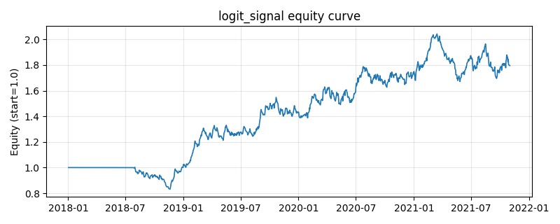

# 策略研究记录：logit_signal

> 类别/途径：**ml_signal** ｜ 类型：cross_section ｜ 方向：只做多

## 一句话思路
自研逻辑回归（IRLS 牛顿迭代 + L2 正则）walk-forward 预测「下期上涨」概率：每 21 期用滚动 2 年窗口重训（标签为已实现的涨跌方向），按概率截面排名做多概率最高的前约 1/3 篮子，概率越高权重越大。

## 收集途径 / 灵感来源
机器学习范式——逻辑回归（极大似然 + IRLS/牛顿法求解，L2 正则），纯 numpy 自研实现，不使用任何第三方 ML 库。

## 核心假设
收益方向（涨/跌）比幅度更易学习：二值标签天然截断极端收益的噪声，sigmoid链接把特征组合压缩到 (0,1) 概率，截面概率排序即为择强汰弱的信号。当涨跌样本严重失衡、特征分布漂移导致概率失准，或方向本身不可预测（有效市场）时失效。

## 参数
- `l2` = 5.0
- `irls_iters` = 12
- `refit` = 21
- `train_window` = 504
- `min_train_dates` = 126
- `top_frac` = 0.3333333333333333

## 实现要点
- 实现文件：`kairos_strategies/channels/ml_signal.py`（类名对应本策略）。
- 输出统一为「目标权重面板」(date × asset)，由 `Backtester` 滞后一期执行，杜绝未来函数。
- 仅使用 numpy/pandas，离线、确定性。

## 数据与回测设置
| 项 | 值 |
|---|---|
| 数据集 | synthetic（8 资产） |
| 区间 | 2018-01-02 ~ 2021-11-01 |
| 期数 | 1000 |
| 年化基准期数 | 252 |
| 单边成本率 | 0.0500% |
| 无风险利率 | 0.00% |

## 回测结果
| 指标 | 值 |
|---|---|
| 累计收益 | 79.59% |
| 年化收益 (CAGR) | 15.90% |
| 年化波动 | 16.17% |
| 夏普 | 0.9935 |
| 索提诺 | 1.5243 |
| 最大回撤 | 18.21% |
| 卡玛 | 0.8732 |
| 胜率 | 50.94% |
| 盈利因子 | 1.1827 |
| 平均换手 | 0.0614 |
| 累计换手 | 61.38 |

## 净值曲线

## 结论与改进方向
- 结果为 **合成数据演示，用于验证实现正确性与 QR 流程**，不构成任何投资建议或收益承诺。
- 改进方向：在真实数据上重跑、参数敏感性分析、加入波动率目标/风控叠加、与其它策略做相关性分散。
