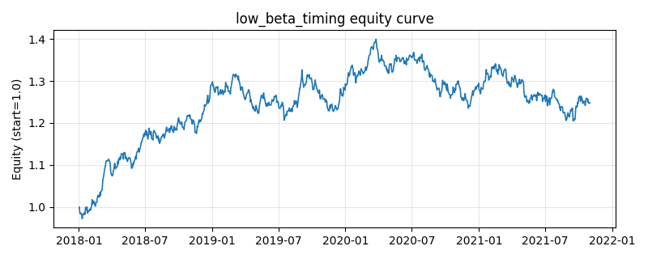

# 策略研究记录：low_beta_timing

> 类别/途径：**defensive** ｜ 类型：cross_section ｜ 方向：只做多

## 一句话思路
低 beta 倾斜配置（只做多满仓）：逐资产滚动 OLS 估计对等权市场的 beta 并朝当期截面均值收缩，权重 ∝ 1/clip(β, floor, cap)——beta 越低权重越高，逐行归一到和 = 1（满仓、无杠杆），并对单资产权重设 max(w_cap, 1/N) 上限用 water-filling 再分配；单个资产 beta 未知时用当期截面中位数填补，整行未知（预热期）回退等权 1/N。组合 beta 因此低于等权基准，是纯『低 beta 倾斜』的风险端配置。

## 收集途径 / 灵感来源
防御类范式——低 beta 倾斜配置 (low-beta / minimum-beta tilt) 的本仓库原创实现；与 regime 渠道 beta_timing（等权预算 × 乘数 g=clip(1+k(1-β))，靠 beta 均值恒等式保持行和）不同，此处是**逆 beta 直接配权 + 截面收缩 + 上限 water-filling**；与 allocation 渠道 inverse_vol / risk_parity_alloc（按波动/协方差分配）的输入变量也不同。

## 核心假设
成因：与 BAB 同源的杠杆约束异象，但只用多头表达——在不能做空或不愿承担空头尾部风险时，把预算按 1/β 重新分配即可把组合 beta 压到等权基准之下，用更少的系统性风险换取相近（甚至更高）的收益，夏普与最大回撤同时改善；beta 的可预测性远强于收益，故这是一种『不预测收益、只管理风险』的稳健倾斜。朝截面均值收缩 beta 可抑制估计噪声导致的排序抖动，单资产上限避免近零 beta 资产垄断预算。失效场景：高 beta 领涨的强牛阶段（成长/题材行情）持续跑输基准；各资产 beta 都贴近 1 的同质化行情中倾斜失去区分度（退化为等权）；beta 结构突变处窗口估计滞后；低 beta 资产拥挤、估值被买贵后异象衰减；等权市场代理粗糙时『低 beta』可能只是低行业暴露。

## 参数
- `beta_window` = 60
- `shrink` = 0.2
- `beta_floor` = 0.2
- `beta_cap` = 2.5
- `w_cap` = 0.4

## 实现要点
- 实现文件：`kairos_strategies/channels/defensive.py`（类名对应本策略）。
- 输出统一为「目标权重面板」(date × asset)，由 `Backtester` 滞后一期执行，杜绝未来函数。
- 仅使用 numpy/pandas，离线、确定性。

## 数据与回测设置
| 项 | 值 |
|---|---|
| 数据集 | synthetic（8 资产） |
| 区间 | 2018-01-02 ~ 2021-11-01 |
| 期数 | 1000 |
| 年化基准期数 | 252 |
| 单边成本率 | 0.0500% |
| 无风险利率 | 0.00% |

## 回测结果
| 指标 | 值 |
|---|---|
| 累计收益 | 24.77% |
| 年化收益 (CAGR) | 5.74% |
| 年化波动 | 8.71% |
| 夏普 | 0.6840 |
| 索提诺 | 1.0011 |
| 最大回撤 | 13.94% |
| 卡玛 | 0.4114 |
| 胜率 | 50.10% |
| 盈利因子 | 1.1145 |
| 平均换手 | 0.0440 |
| 累计换手 | 43.97 |

## 净值曲线

## 结论与改进方向
- 结果为 **合成数据演示，用于验证实现正确性与 QR 流程**，不构成任何投资建议或收益承诺。
- 改进方向：在真实数据上重跑、参数敏感性分析、加入波动率目标/风控叠加、与其它策略做相关性分散。
