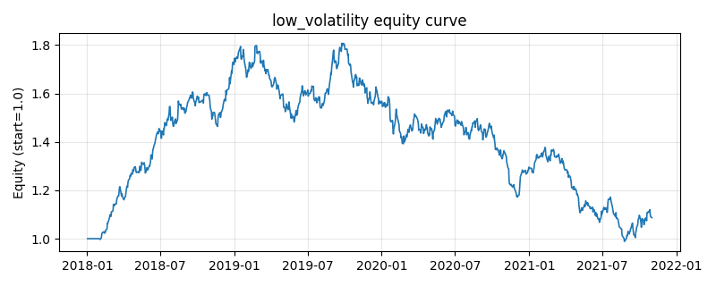

# 策略研究记录：low_volatility

> 类别/途径：**factor** ｜ 类型：cross_section ｜ 方向：只做多

## 一句话思路
低波动异象：按滚动已实现波动升序排名，做多波动最低的一篮子，波动越低权重越高。

## 收集途径 / 灵感来源
因子异象——低波动 (low-volatility anomaly)，纯价格/波动构造。

## 核心假设
高波动『彩票型』资产因投资者偏好博取高收益而被系统性高估，加之机构受杠杆约束倾向用高 beta 替代加杠杆，使低波动组合长期风险调整后收益更优。当低波资产拥挤/估值过高，或危机中相关性趋同、市场普跌时，该优势可能减弱甚至反转。

## 参数
- `vol_window` = 21
- `top_frac` = 0.3333333333333333

## 实现要点
- 实现文件：`kairos_strategies/channels/factor.py`（类名对应本策略）。
- 输出统一为「目标权重面板」(date × asset)，由 `Backtester` 滞后一期执行，杜绝未来函数。
- 仅使用 numpy/pandas，离线、确定性。

## 数据与回测设置
| 项 | 值 |
|---|---|
| 数据集 | synthetic（8 资产） |
| 区间 | 2018-01-02 ~ 2021-11-01 |
| 期数 | 1000 |
| 年化基准期数 | 252 |
| 单边成本率 | 0.0500% |
| 无风险利率 | 0.00% |

## 回测结果
| 指标 | 值 |
|---|---|
| 累计收益 | 8.68% |
| 年化收益 (CAGR) | 2.12% |
| 年化波动 | 15.54% |
| 夏普 | 0.2126 |
| 索提诺 | 0.3029 |
| 最大回撤 | 45.32% |
| 卡玛 | 0.0468 |
| 胜率 | 50.05% |
| 盈利因子 | 1.0350 |
| 平均换手 | 0.3075 |
| 累计换手 | 307.53 |

## 净值曲线

## 结论与改进方向
- 结果为 **合成数据演示，用于验证实现正确性与 QR 流程**，不构成任何投资建议或收益承诺。
- 改进方向：在真实数据上重跑、参数敏感性分析、加入波动率目标/风控叠加、与其它策略做相关性分散。
