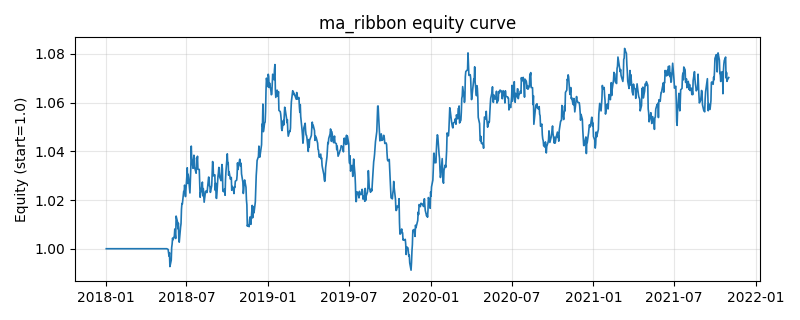

# 策略研究记录：ma_ribbon

> 类别/途径：**trend** ｜ 类型：timing ｜ 方向：只做多

## 一句话思路
均线带 (MA Ribbon)：对一组均线(默认 10/20/50/100)统计相邻「短均线在长均线之上」的对数占比作为排列分数∈[0,1]，完美多头排列分数=1；单资产仓位 = 等预算(1/N) × 排列分数，逐行和≤1。

## 收集途径 / 灵感来源
经典技术分析——均线带 / 多周期移动平均排列 (moving-average ribbon)（本仓库原创实现）。

## 核心假设
核心假设：当短、中、长期均线自上而下依次排列(多头排列)时，多周期趋势方向一致，趋势更可信、更可能延续；用「排列分数」而非单一金叉做连续度量，可在趋势部分对齐时小仓、完全对齐时满仓，平滑信号、降低假突破。失效场景：均线本质滞后，趋势末端与急速反转时排列尚未翻转已回吐利润；无趋势的横盘缠绕期分数在临界附近抖动。

## 参数
- `windows` = [10, 20, 50, 100]

## 实现要点
- 实现文件：`kairos_strategies/channels/trend.py`（类名对应本策略）。
- 输出统一为「目标权重面板」(date × asset)，由 `Backtester` 滞后一期执行，杜绝未来函数。
- 仅使用 numpy/pandas，离线、确定性。

## 数据与回测设置
| 项 | 值 |
|---|---|
| 数据集 | synthetic（8 资产） |
| 区间 | 2018-01-02 ~ 2021-11-01 |
| 期数 | 1000 |
| 年化基准期数 | 252 |
| 单边成本率 | 0.0500% |
| 无风险利率 | 0.00% |

## 回测结果
| 指标 | 值 |
|---|---|
| 累计收益 | 7.03% |
| 年化收益 (CAGR) | 1.73% |
| 年化波动 | 4.94% |
| 夏普 | 0.3711 |
| 索提诺 | 0.5323 |
| 最大回撤 | 7.85% |
| 卡玛 | 0.2199 |
| 胜率 | 49.72% |
| 盈利因子 | 1.0640 |
| 平均换手 | 0.0307 |
| 累计换手 | 30.70 |

## 净值曲线

## 结论与改进方向
- 结果为**合成数据上的演示**，用于验证实现正确性与 QR 流程，不构成任何投资建议或收益承诺。
- 改进方向：在真实数据上重跑、参数敏感性分析、加入波动率目标/风控叠加、与其它策略做相关性分散。
