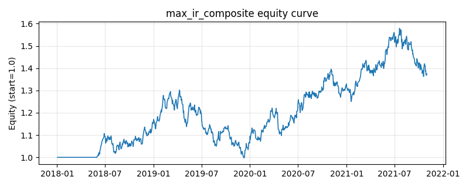

# 策略研究记录：max_ir_composite

> 类别/途径：**multi_factor** ｜ 类型：cross_section ｜ 方向：只做多

## 一句话思路
最大 IR 复合：对每个基础因子用截至 t−2 的滚动窗口同时估计 IC 均值与 IC 标准差，以信息比率 IR = mean(IC)/std(IC)（标准差设下限防爆炸）作为该因子在第 t 期的复合权重，IR 越高（预测力既强又稳）权重越大，可为负权；加权合成后做多复合分最高的约 1/3 篮子。

## 收集途径 / 灵感来源
多因子合成范式——最大化信息比率（max-IR / Sharpe 型因子配权，Grinold-Kahn 主动管理框架里的因子层版本），本仓库原创 numpy/pandas 实现：滚动 IC 均值与标准差均walk-forward 计算（标签滞后两期），不依赖任何优化器。与 ic_weighted_composite 的差别只在权重的分母——多除一个 IC 标准差，用来惩罚不稳定的因子。

## 核心假设
成因：只看 IC 均值会选中「偶尔爆发、大部分时间无效」的因子——它的 IC 均值可能不低，但方差极大，实盘贡献不稳定；用 IC 均值除以 IC 标准差（信息比率）配权，等价于在因子层面做夏普最大化，惩罚时灵时不灵的因子、奖励持续有效的因子，复合alpha 的时序稳定性与风险调整后表现优于纯 IC 加权，本质是给因子权重加了一层「方差惩罚」。失效条件：IC 标准差在窗口内被少数极端值主导时 IR 会剧烈抖动；因子 IC 接近常数（std ≈ 0）时 IR 趋于无穷，需靠标准差下限兜底；当高 IR 因子恰好是低波动、低收益的防御因子时，组合会在牛市里系统性跑输；风格切换处 IR 与 IC 一样滞后。

## 参数
- `mom_window` = 63
- `vol_window` = 21
- `rev_window` = 5
- `qual_window` = 21
- `top_frac` = 0.3333333333333333
- `xs_norm` = z
- `score_lag` = 1
- `label_lag` = 2
- `ic_window` = 126
- `ic_min_obs` = 42
- `ic_min_assets` = 3
- `ic_scheme` = ir
- `ir_std_floor` = 0.02

## 实现要点
- 实现文件：`kairos_strategies/channels/multi_factor.py`（类名对应本策略）。
- 输出统一为「目标权重面板」(date × asset)，由 `Backtester` 滞后一期执行，杜绝未来函数。
- 仅使用 numpy/pandas，离线、确定性。

## 数据与回测设置
| 项 | 值 |
|---|---|
| 数据集 | synthetic（8 资产） |
| 区间 | 2018-01-02 ~ 2021-11-01 |
| 期数 | 1000 |
| 年化基准期数 | 252 |
| 单边成本率 | 0.0500% |
| 无风险利率 | 0.00% |

## 回测结果
| 指标 | 值 |
|---|---|
| 累计收益 | 37.43% |
| 年化收益 (CAGR) | 8.34% |
| 年化波动 | 14.07% |
| 夏普 | 0.6400 |
| 索提诺 | 0.9355 |
| 最大回撤 | 23.37% |
| 卡玛 | 0.3570 |
| 胜率 | 51.34% |
| 盈利因子 | 1.1134 |
| 平均换手 | 0.4320 |
| 累计换手 | 431.95 |

## 净值曲线

## 结论与改进方向
- 结果为**合成数据上的演示**，用于验证实现正确性与 QR 流程，不构成任何投资建议或收益承诺。
- 改进方向：在真实数据上重跑、参数敏感性分析、加入波动率目标/风控叠加、与其它策略做相关性分散。
