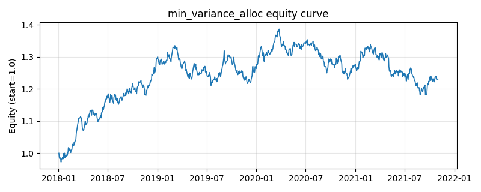

# 策略研究记录：min_variance_alloc

> 类别/途径：**allocation** ｜ 类型：cross_section ｜ 方向：只做多

## 一句话思路
全局最小方差：滚动样本协方差下解 w ∝ Σ⁻¹1（岭正则 + np.linalg.solve，奇异回退 pinv），负分量裁剪到 0 后重新归一，保证 long-only 满仓。

## 收集途径 / 灵感来源
组合配置经典范式——Markowitz 全局最小方差组合 (GMV)，纯 numpy 原创实现。

## 核心假设
协方差是收益分布中最可估计的部分，最小方差组合位于有效前沿最左端，在不预测收益的前提下最小化组合波动。对协方差估计误差高度敏感（『误差最大化』效应），样本病态时会给出极端权重——用岭正则与 long-only 投影约束之。

## 参数
- `window` = 60
- `ridge` = 1e-10

## 实现要点
- 实现文件：`kairos_strategies/channels/allocation.py`（类名对应本策略）。
- 输出统一为「目标权重面板」(date × asset)，由 `Backtester` 滞后一期执行，杜绝未来函数。
- 仅使用 numpy/pandas，离线、确定性。

## 数据与回测设置
| 项 | 值 |
|---|---|
| 数据集 | synthetic（8 资产） |
| 区间 | 2018-01-02 ~ 2021-11-01 |
| 期数 | 1000 |
| 年化基准期数 | 252 |
| 单边成本率 | 0.0500% |
| 无风险利率 | 0.00% |

## 回测结果
| 指标 | 值 |
|---|---|
| 累计收益 | 23.11% |
| 年化收益 (CAGR) | 5.38% |
| 年化波动 | 8.75% |
| 夏普 | 0.6427 |
| 索提诺 | 0.9399 |
| 最大回撤 | 14.83% |
| 卡玛 | 0.3628 |
| 胜率 | 51.00% |
| 盈利因子 | 1.1066 |
| 平均换手 | 0.0516 |
| 累计换手 | 51.62 |

## 净值曲线

## 结论与改进方向
- 结果为 **合成数据演示，用于验证实现正确性与 QR 流程**，不构成任何投资建议或收益承诺。
- 改进方向：在真实数据上重跑、参数敏感性分析、加入波动率目标/风控叠加、与其它策略做相关性分散。
