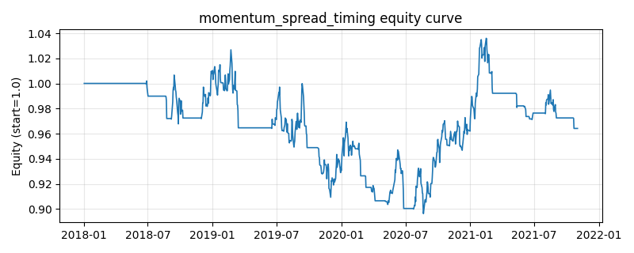

# 策略研究记录：momentum_spread_timing

> 类别/途径：**momentum_adv** ｜ 类型：cross_section ｜ 方向：可多空

## 一句话思路
多空动量价差择时：做多赢家/做空输家构成美元中性 WML（行和≈0、绝对值和≤1），但仅当『动量价差动量』为正（赢家组近期仍相对输家组走强）时才持仓，价差转弱即整行平仓避险。

## 收集途径 / 灵感来源
进阶动量变体——动量价差/波动择时 (momentum spread timing, Daniel-Moskowitz 动量崩溃择时思路，本仓库原创实现)；与 long_short 渠道的 xs_momentum_ls（**始终满仓**多空）不同，此处按价差动量**动态开关**多空敞口，崩溃来临前主动离场。

## 核心假设
针对动量的『崩溃 + 拥挤』缺陷：多空动量价差 (WML) 在价差持续走阔时最稳，而在价差见顶收敛时最易崩溃——拥挤的同向资金一旦反向解仓、或危机后前期弱者暴力反弹，WML 会短期内巨亏。用价差组合自身的近期已实现收益（赢家腿减输家腿）作为『价差动量』开关，在其转负时空仓，可规避大部分崩溃段落。失效条件：价差反复拉锯的震荡期会频繁开关、放大换手与成本，并被假信号两头打脸；开关本身滞后，对突发单日崩溃反应不及。

## 参数
- `lookback` = 126
- `skip` = 21
- `top_frac` = 0.3333333333333333
- `leg_budget` = 0.5
- `spread_window` = 21

## 实现要点
- 实现文件：`kairos_strategies/channels/momentum_adv.py`（类名对应本策略）。
- 输出统一为「目标权重面板」(date × asset)，由 `Backtester` 滞后一期执行，杜绝未来函数。
- 仅使用 numpy/pandas，离线、确定性。

## 数据与回测设置
| 项 | 值 |
|---|---|
| 数据集 | synthetic（8 资产） |
| 区间 | 2018-01-02 ~ 2021-11-01 |
| 期数 | 1000 |
| 年化基准期数 | 252 |
| 单边成本率 | 0.0500% |
| 无风险利率 | 0.00% |

## 回测结果
| 指标 | 值 |
|---|---|
| 累计收益 | -3.59% |
| 年化收益 (CAGR) | -0.92% |
| 年化波动 | 6.45% |
| 夏普 | -0.1103 |
| 索提诺 | -0.1550 |
| 最大回撤 | 12.71% |
| 卡玛 | -0.0721 |
| 胜率 | 44.15% |
| 盈利因子 | 0.9746 |
| 平均换手 | 0.1455 |
| 累计换手 | 145.46 |

## 净值曲线

## 结论与改进方向
- 结果为**合成数据上的演示**，用于验证实现正确性与 QR 流程，不构成任何投资建议或收益承诺。
- 改进方向：在真实数据上重跑、参数敏感性分析、加入波动率目标/风控叠加、与其它策略做相关性分散。
