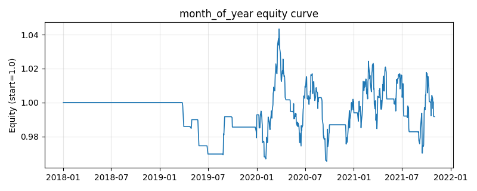

# 策略研究记录：month_of_year

> 类别/途径：**seasonality** ｜ 类型：timing ｜ 方向：只做多

## 一句话思路
月份季节性：仅当当日所处月份的历史（截至当期之前）平均日收益为正时持有等权组合，否则空仓。

## 收集途径 / 灵感来源
日历效应文献范式——month-of-the-year seasonality，本仓库原创实现。

## 核心假设
真实市场常见假说：一月效应（税收卖出回补、奖金流入）、Sell in May（夏季成交清淡）、基金年初建仓与年末冲业绩等带来月份季节性。注意：在合成随机数据上通常无显著 edge，结果依赖数据本身。

## 参数
- `min_obs` = 40

## 实现要点
- 实现文件：`kairos_strategies/channels/seasonality.py`（类名对应本策略）。
- 输出统一为「目标权重面板」(date × asset)，由 `Backtester` 滞后一期执行，杜绝未来函数。
- 仅使用 numpy/pandas，离线、确定性。

## 数据与回测设置
| 项 | 值 |
|---|---|
| 数据集 | synthetic（8 资产） |
| 区间 | 2018-01-02 ~ 2021-11-01 |
| 期数 | 1000 |
| 年化基准期数 | 252 |
| 单边成本率 | 0.0500% |
| 无风险利率 | 0.00% |

## 回测结果
| 指标 | 值 |
|---|---|
| 累计收益 | -0.83% |
| 年化收益 (CAGR) | -0.21% |
| 年化波动 | 4.71% |
| 夏普 | -0.0209 |
| 索提诺 | -0.0292 |
| 最大回撤 | 7.48% |
| 卡玛 | -0.0280 |
| 胜率 | 46.03% |
| 盈利因子 | 0.9943 |
| 平均换手 | 0.0752 |
| 累计换手 | 75.19 |

## 净值曲线

## 结论与改进方向
- 结果为**合成数据上的演示**，用于验证实现正确性与 QR 流程，不构成任何投资建议或收益承诺。
- 改进方向：在真实数据上重跑、参数敏感性分析、加入波动率目标/风控叠加、与其它策略做相关性分散。
