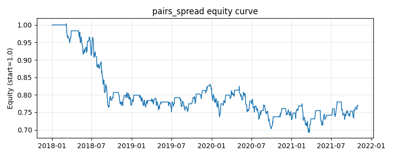

# 策略研究记录：pairs_spread

> 类别/途径：**meanrev** ｜ 类型：cross_section ｜ 方向：可多空

## 一句话思路
配对价差统计套利：取两只资产的对数价差滚动 z-score，价差被低估时做多 A/做空 B、被高估时反向，回归中枢平仓；两腿等权，组合市场中性。

## 收集途径 / 灵感来源
统计套利经典范式——pairs trading / 价差 z-score 多空（本仓库原创实现）。

## 核心假设
核心假设：同族资产的对数价差（相对估值）比绝对价格更平稳，价差极端偏离后倾向收敛，多空对冲可剥离市场 beta。失效场景：两腿基本面脱钩（协整关系破裂）时价差不回归而是持续发散，亏损无自然上限；配对选择错误是最大风险来源。

## 参数
- `leg_a` = A0
- `leg_b` = A1
- `window` = 40
- `entry_z` = 1.5
- `exit_z` = 0.5
- `leg_weight` = 0.5

## 实现要点
- 实现文件：`kairos_strategies/channels/meanrev.py`（类名对应本策略）。
- 输出统一为「目标权重面板」(date × asset)，由 `Backtester` 滞后一期执行，杜绝未来函数。
- 仅使用 numpy/pandas，离线、确定性。

## 数据与回测设置
| 项 | 值 |
|---|---|
| 数据集 | synthetic（8 资产） |
| 区间 | 2018-01-02 ~ 2021-11-01 |
| 期数 | 1000 |
| 年化基准期数 | 252 |
| 单边成本率 | 0.0500% |
| 无风险利率 | 0.00% |

## 回测结果
| 指标 | 值 |
|---|---|
| 累计收益 | -23.01% |
| 年化收益 (CAGR) | -6.38% |
| 年化波动 | 11.74% |
| 夏普 | -0.5025 |
| 索提诺 | -0.6930 |
| 最大回撤 | 31.01% |
| 卡玛 | -0.2056 |
| 胜率 | 47.10% |
| 盈利因子 | 0.9053 |
| 平均换手 | 0.0679 |
| 累计换手 | 67.90 |

## 净值曲线

## 结论与改进方向
- 结果为 **合成数据演示，用于验证实现正确性与 QR 流程**，不构成任何投资建议或收益承诺。
- 改进方向：在真实数据上重跑、参数敏感性分析、加入波动率目标/风控叠加、与其它策略做相关性分散。
