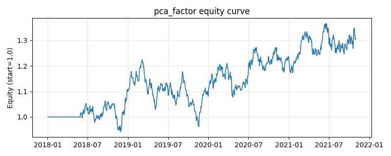

# 策略研究记录：pca_factor

> 类别/途径：**multi_factor** ｜ 类型：cross_section ｜ 方向：只做多

## 一句话思路
PCA 复合因子：把四个基础因子的截面标准化值逐日堆成 N×F 矩阵，其 ZᵀZ/(N−1) 即当期因子相关阵；对截至 t−1 的滚动窗口（默认半年）平均相关阵做 numpy.linalg.eigh 特征分解，取最大特征值对应的特征向量（按 Σv ≥ 0 定向、单位化）作为复合权重，复合 alpha = 当期截面 z 向量在该方向上的投影，做多最高的约 1/3 篮子。

## 收集途径 / 灵感来源
多因子合成范式——因子层 PCA / 主成分 alpha（statistical risk model 的主成分思想反过来用作 alpha 合成方向），本仓库原创 numpy 实现：逐日因子相关阵 + 尾部滚动平均 + ``numpy.linalg.eigh`` 特征分解 + 确定性符号定向，不用 sklearn/scipy。与 statarb.eof_stat_arb（对**收益**做 PCA 提取因子、再对残差做均值回归的多空策略）完全不同：此处 PCA 作用在**因子截面标准化值**上，输出的是复合权重而非公允价格。

## 核心假设
成因：多个价格因子之间往往被同一个潜在的市场/风格维度驱动（例如趋势行情里动量与趋势质量同涨同跌），第一主成分正是这个共同维度的方向，用它做复合权重相当于让数据自己决定「哪些因子在讲同一件事、该合并放大」，无需 IC 标签、无需主观先验，且对因子间相关结构的变化自适应；相比 IC/IR 加权，它不依赖收益标签，估计噪声更小、换手更低。失效条件：主成分是「方差最大」方向而非「收益最高」方向——当共同维度恰好是与未来收益无关的噪声（或所有因子等方差且互不相关时相关阵退化为单位阵，主成分方向任意）时，复合 alpha 会退化成某个 arbitrary 的因子组合；因子相关结构突变（危机中相关性趋同）会让载荷急转、产生跳变换手；特征向量符号本身有歧义，必须靠定向规则固定（此处按 Σv ≥ 0）。

## 参数
- `mom_window` = 63
- `vol_window` = 21
- `rev_window` = 5
- `qual_window` = 21
- `top_frac` = 0.3333333333333333
- `xs_norm` = z
- `score_lag` = 1
- `pca_window` = 126
- `pca_min_obs` = 42
- `n_components` = 1
- `sign_rule` = sum_nonneg

## 实现要点
- 实现文件：`kairos_strategies/channels/multi_factor.py`（类名对应本策略）。
- 输出统一为「目标权重面板」(date × asset)，由 `Backtester` 滞后一期执行，杜绝未来函数。
- 仅使用 numpy/pandas，离线、确定性。

## 数据与回测设置
| 项 | 值 |
|---|---|
| 数据集 | synthetic（8 资产） |
| 区间 | 2018-01-02 ~ 2021-11-01 |
| 期数 | 1000 |
| 年化基准期数 | 252 |
| 单边成本率 | 0.0500% |
| 无风险利率 | 0.00% |

## 回测结果
| 指标 | 值 |
|---|---|
| 累计收益 | 30.74% |
| 年化收益 (CAGR) | 6.99% |
| 年化波动 | 14.32% |
| 夏普 | 0.5434 |
| 索提诺 | 0.7891 |
| 最大回撤 | 21.47% |
| 卡玛 | 0.3255 |
| 胜率 | 51.17% |
| 盈利因子 | 1.0955 |
| 平均换手 | 0.3395 |
| 累计换手 | 339.46 |

## 净值曲线

## 结论与改进方向
- 结果为**合成数据上的演示**，用于验证实现正确性与 QR 流程，不构成任何投资建议或收益承诺。
- 改进方向：在真实数据上重跑、参数敏感性分析、加入波动率目标/风控叠加、与其它策略做相关性分散。
