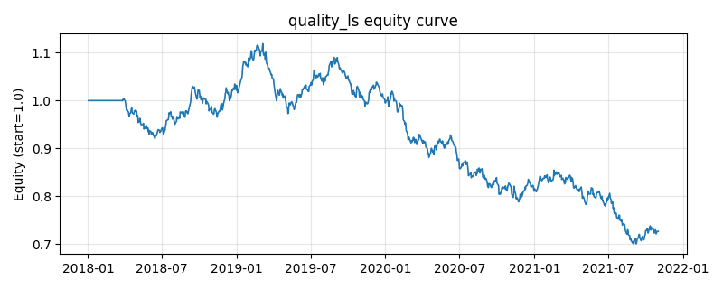

# 策略研究记录：quality_ls

> 类别/途径：**long_short** ｜ 类型：cross_section ｜ 方向：可多空

## 一句话思路
质量多空：用「带符号价格效率（净位移/路径长度）+ 低波动」的截面标准化合成分衡量趋势质量，做多走得又直又稳的 top 分位、做空震荡剧烈的 bottom 分位，两腿等权各占 0.5 预算，组合美元中性。

## 收集途径 / 灵感来源
多空股票 alpha 范式——质量因子（价格效率 efficiency ratio + low-volatility 合成）的市场中性版本，本仓库原创实现，纯价格/波动构造、不臆造基本面；与 factor 渠道的 trend_quality / low_volatility（各自只做多、单一成分）不同，此处是双成分截面标准化合成后两端下注。

## 核心假设
成因：净位移占路径长度比例高，说明行情由持续的信息流驱动而非噪声来回拉锯，这类「干净趋势」的动量更可信、回撤更小；低波动分量则捕捉彩票型高波资产被系统性高估的异象。两个成分先做截面标准化再加权合成，量纲统一、互不淹没，选出的多头是「趋势平滑且波动低」、空头是「震荡剧烈且波动高」的资产，价差来自信息驱动收益与噪声驱动收益的分化。失效条件：趋势末端——效率比记录的是历史平滑度，拐点处高质量资产率先反转；波动结构突变（低波标的遭遇黑天鹅）使低波分量反向；高噪声环境下两个成分的截面区分度同时下降；合成权重是主观先验，成分间相关性结构变化会让合成分退化为单一因子。

## 参数
- `window` = 60
- `vol_window` = 21
- `eff_weight` = 0.5
- `vol_weight` = 0.5
- `top_frac` = 0.3333333333333333
- `leg_budget` = 0.5

## 实现要点
- 实现文件：`kairos_strategies/channels/long_short.py`（类名对应本策略）。
- 输出统一为「目标权重面板」(date × asset)，由 `Backtester` 滞后一期执行，杜绝未来函数。
- 仅使用 numpy/pandas，离线、确定性。

## 数据与回测设置
| 项 | 值 |
|---|---|
| 数据集 | synthetic（8 资产） |
| 区间 | 2018-01-02 ~ 2021-11-01 |
| 期数 | 1000 |
| 年化基准期数 | 252 |
| 单边成本率 | 0.0500% |
| 无风险利率 | 0.00% |

## 回测结果
| 指标 | 值 |
|---|---|
| 累计收益 | -27.31% |
| 年化收益 (CAGR) | -7.72% |
| 年化波动 | 9.36% |
| 夏普 | -0.8115 |
| 索提诺 | -1.0969 |
| 最大回撤 | 37.39% |
| 卡玛 | -0.2065 |
| 胜率 | 47.77% |
| 盈利因子 | 0.8792 |
| 平均换手 | 0.1996 |
| 累计换手 | 199.63 |

## 净值曲线

## 结论与改进方向
- 结果为 **合成数据演示，用于验证实现正确性与 QR 流程**，不构成任何投资建议或收益承诺。
- 改进方向：在真实数据上重跑、参数敏感性分析、加入波动率目标/风控叠加、与其它策略做相关性分散。
