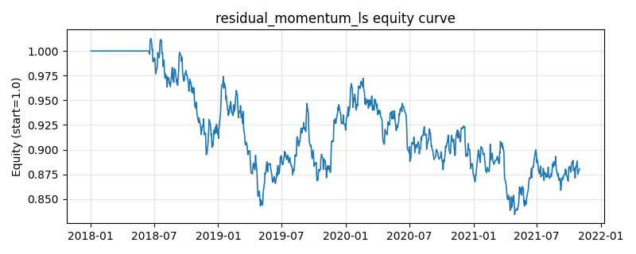

# 策略研究记录：residual_momentum_ls

> 类别/途径：**long_short** ｜ 类型：cross_section ｜ 方向：可多空

## 一句话思路
残差动量多空：对每个资产用尾部窗口把它对「等权市场收益」做过原点回归得到 beta，残差 = 自身收益 - beta×市场收益，按 score_window 期累计残差（以残差波动标准化）截面排序，做多残差动量最强的 top 分位、做空最弱的 bottom 分位，两腿等权各占 0.5 预算，组合美元中性。

## 收集途径 / 灵感来源
多空股票 alpha 范式——残差动量 (residual momentum, Blitz-Huij-Martens 思路) 的市场中性版本，本仓库原创 numpy/pandas 实现（滚动过原点回归 beta + 波动标准化累计残差，不用 statsmodels）；与 factor 渠道的 idio_momentum（只做多、且用「动量减截面均值」近似而非回归残差）在信号构造与组合形态上均不同。

## 核心假设
成因：原始动量被市场 beta 污染——高 beta 资产在上涨期「看起来强」，其强势只是市场的放大镜像，一旦市场回调便加倍回吐；把等权市场收益回归掉之后，累计残差更接近特质信息（业绩、竞争力、资金关注度）的逐步扩散速度，截面区分度更高、时序更稳定，且多空两端再对冲掉残余市场敞口，赚的是纯特质相对强弱。失效条件：等权市场收益是粗糙的单因子代理，当真实因子结构多元（行业/风格主导）或 beta 不稳定时，残差仍被共同因子污染，排序失真；市场急转弯处尾部窗口估出的 beta 滞后于真实敞口；特质收益由一次性事件（跳空、复牌）贡献时残差动量追错方向；策略拥挤后残差动量价差被提前收敛。

## 参数
- `reg_window` = 60
- `score_window` = 60
- `top_frac` = 0.3333333333333333
- `leg_budget` = 0.5

## 实现要点
- 实现文件：`kairos_strategies/channels/long_short.py`（类名对应本策略）。
- 输出统一为「目标权重面板」(date × asset)，由 `Backtester` 滞后一期执行，杜绝未来函数。
- 仅使用 numpy/pandas，离线、确定性。

## 数据与回测设置
| 项 | 值 |
|---|---|
| 数据集 | synthetic（8 资产） |
| 区间 | 2018-01-02 ~ 2021-11-01 |
| 期数 | 1000 |
| 年化基准期数 | 252 |
| 单边成本率 | 0.0500% |
| 无风险利率 | 0.00% |

## 回测结果
| 指标 | 值 |
|---|---|
| 累计收益 | -11.94% |
| 年化收益 (CAGR) | -3.15% |
| 年化波动 | 8.93% |
| 夏普 | -0.3142 |
| 索提诺 | -0.4361 |
| 最大回撤 | 17.61% |
| 卡玛 | -0.1790 |
| 胜率 | 48.41% |
| 盈利因子 | 0.9485 |
| 平均换手 | 0.1517 |
| 累计换手 | 151.70 |

## 净值曲线

## 结论与改进方向
- 结果为 **合成数据演示，用于验证实现正确性与 QR 流程**，不构成任何投资建议或收益承诺。
- 改进方向：在真实数据上重跑、参数敏感性分析、加入波动率目标/风控叠加、与其它策略做相关性分散。
