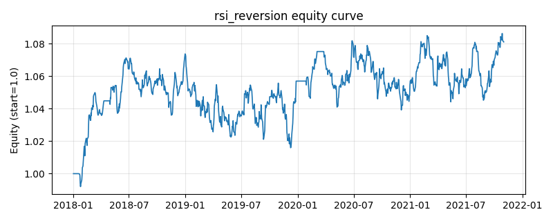

# 策略研究记录：rsi_reversion

> 类别/途径：**technical** ｜ 类型：timing ｜ 方向：只做多

## 一句话思路
RSI 均值回归：超卖买入，回升至中性上方离场（双阈值滞后）。

## 收集途径 / 灵感来源
经典技术分析——RSI 超买超卖。

## 核心假设
短期超跌后价格倾向反弹；及时止盈避免持有下行趋势。

## 参数
- `window` = 14
- `enter_below` = 35.0
- `exit_above` = 55.0

## 实现要点
- 实现文件：`kairos_strategies/channels/technical.py`（类名对应本策略）。
- 输出统一为「目标权重面板」(date × asset)，由 `Backtester` 滞后一期执行，杜绝未来函数。
- 仅使用 numpy/pandas，离线、确定性。

## 数据与回测设置
| 项 | 值 |
|---|---|
| 数据集 | synthetic（8 资产） |
| 区间 | 2018-01-02 ~ 2021-11-01 |
| 期数 | 1000 |
| 年化基准期数 | 252 |
| 单边成本率 | 0.0500% |
| 无风险利率 | 0.00% |

## 回测结果
| 指标 | 值 |
|---|---|
| 累计收益 | 8.11% |
| 年化收益 (CAGR) | 1.98% |
| 年化波动 | 4.37% |
| 夏普 | 0.4716 |
| 索提诺 | 0.6958 |
| 最大回撤 | 5.38% |
| 卡玛 | 0.3688 |
| 胜率 | 51.44% |
| 盈利因子 | 1.0810 |
| 平均换手 | 0.0239 |
| 累计换手 | 23.91 |

## 净值曲线

## 结论与改进方向
- 结果为 **合成数据演示，用于验证实现正确性与 QR 流程**，不构成任何投资建议或收益承诺。
- 改进方向：在真实数据上重跑、参数敏感性分析、加入波动率目标/风控叠加、与其它策略做相关性分散。
