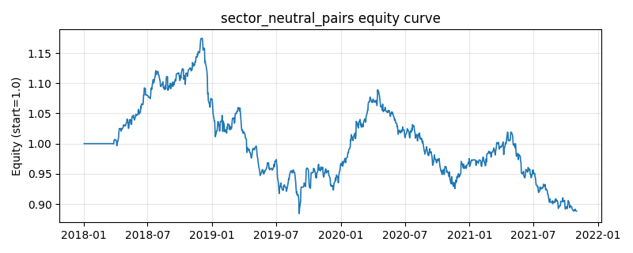

# 策略研究记录：sector_neutral_pairs

> 类别/途径：**pairs** ｜ 类型：cross_section ｜ 方向：可多空

## 一句话思路
板块中性配对：先用尾部收益的相关系数矩阵构造距离 d = 1 - corr，跑自研的平均链接层次聚类把资产并成 n_sectors 个「板块」；再在每个板块**内部**按尾部相关性最强的顺序取出互不共用腿的配对（每块最多 max_pairs_per_sector 对），用 OLS 估 β 后对对数残差做滚动 z-score 反向持仓。预算先等分到各活跃板块、再等分到块内各对，每一对两腿等幅反向，故**每个板块的净敞口恒为 0（板块中性）**、整体行和恒为 0、绝对值和 ≤ 1。

## 收集途径 / 灵感来源
统计套利经典范式——行业内配对 / 板块中性多空（sector-neutral pairs trading）。本仓库原创 numpy 实现：相关距离 + **平均链接层次聚类**（不用 scipy.cluster）、块内相关性排序选对、两级等分预算。与 statarb 渠道 basket_neutral（按波动分成两个篮子、交易**篮子之间**的便宜度价差）方向相反：那里是篮子间多空，这里是**篮子内部**配对、篮子之间零敞口；与 coint_pairs / ssd_pairs 的自由配对也不同，配对候选被板块结构约束。

## 核心假设
核心假设：相关性最高的资产对更可能同属一个「板块」（同行业/同风格/同资金链），板块内部的相对估值偏离是流动性与情绪造成的临时错价，会收敛；把配对限制在板块内部并让每块净敞口为 0，可同时剥离市场 beta **与板块 beta**，只承担「块内相对价值」这一维风险，比全 universe 自由配对更抗行业性冲击。失效场景：板块划分依赖历史相关性，相关性结构切换（板块轮动、危机期相关性齐涨）时分组不稳定、换手上升；块内资产太少（< 2）则该块无法配对、预算浪费；若真正的错价发生在**跨板块**之间，本策略结构上就抓不到。

## 参数
- `corr_window` = 60
- `est_window` = 60
- `z_window` = 25
- `refit_freq` = 15
- `entry_z` = 1.2
- `exit_z` = 0.3
- `n_sectors` = 3
- `max_pairs_per_sector` = 1
- `gross_budget` = 1.0

## 实现要点
- 实现文件：`kairos_strategies/channels/pairs.py`（类名对应本策略）。
- 输出统一为「目标权重面板」(date × asset)，由 `Backtester` 滞后一期执行，杜绝未来函数。
- 仅使用 numpy/pandas，离线、确定性。

## 数据与回测设置
| 项 | 值 |
|---|---|
| 数据集 | synthetic（8 资产） |
| 区间 | 2018-01-02 ~ 2021-11-01 |
| 期数 | 1000 |
| 年化基准期数 | 252 |
| 单边成本率 | 0.0500% |
| 无风险利率 | 0.00% |

## 回测结果
| 指标 | 值 |
|---|---|
| 累计收益 | -11.18% |
| 年化收益 (CAGR) | -2.94% |
| 年化波动 | 8.68% |
| 夏普 | -0.3007 |
| 索提诺 | -0.4104 |
| 最大回撤 | 24.72% |
| 卡玛 | -0.1191 |
| 胜率 | 48.82% |
| 盈利因子 | 0.9486 |
| 平均换手 | 0.2735 |
| 累计换手 | 273.54 |

## 净值曲线

## 结论与改进方向
- 结果为 **合成数据演示，用于验证实现正确性与 QR 流程**，不构成任何投资建议或收益承诺。
- 改进方向：在真实数据上重跑、参数敏感性分析、加入波动率目标/风控叠加、与其它策略做相关性分散。
