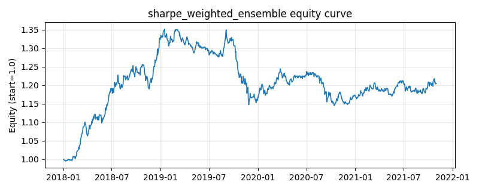

# 策略研究记录：sharpe_weighted_ensemble

> 类别/途径：**ensemble** ｜ 类型：cross_section ｜ 方向：只做多

## 一句话思路
夏普加权元策略（walk-forward）：对 sma_cross、donchian_turtle、ts_momentum、low_volatility、inverse_vol 各做零成本回测得到策略收益序列，第 t 期按各基础策略「截至 t-1」的 window 期滚动年化夏普（负值 clip 到 0）作为混合系数，逐行归一到和为 1 后加权其权重面板；预热期或全部夏普非正时回退等权。

## 收集途径 / 灵感来源
元策略范式——策略层夏普加权 / 表现倾斜配置（performance-tilted fund-of-strategies），思路来自 manager momentum 与均值-方差配置的对角近似；滚动夏普、clip≥0、shift(1) 的 walk-forward 系数与退化回退为本渠道原创实现，基础策略复用本仓库已稳定渠道的公开类。

## 核心假设
核心假设：策略的风险调整后表现存在持续性（manager/strategy momentum）——近期滚动夏普高的基础策略，其信号与当前市场性格更契合，把资金倾斜给它可提升元策略的期望夏普；clip≥0 保证系数非负（只做多策略、不做空失效策略），归一保证无杠杆。系数由滚动统计再 shift(1) 得到，第 t 期只用 [0, t-1] 的回测收益，严格防未来。失效场景：策略收益均值回复（近期赢家随即变输家，倾斜反而追高杀低）、窗口过短使夏普估计噪声主导、危机中所有基础策略夏普同时为负而被迫等权（此时它退化为 equal_weight_ensemble，无法降低总暴露）。

## 参数
- `weighting` = sharpe
- `window` = 126
- `min_obs` = 63
- `vol_floor` = 0.0001
- `clip_lower` = 0.0
- `cost_rate` = 0.0
- `n_bases` = 5
- `bases` = ['sma_cross', 'donchian_turtle', 'ts_momentum', 'low_volatility', 'inverse_vol']

## 实现要点
- 实现文件：`kairos_strategies/channels/ensemble.py`（类名对应本策略）。
- 输出统一为「目标权重面板」(date × asset)，由 `Backtester` 滞后一期执行，杜绝未来函数。
- 仅使用 numpy/pandas，离线、确定性。

## 数据与回测设置
| 项 | 值 |
|---|---|
| 数据集 | synthetic（8 资产） |
| 区间 | 2018-01-02 ~ 2021-11-01 |
| 期数 | 1000 |
| 年化基准期数 | 252 |
| 单边成本率 | 0.0500% |
| 无风险利率 | 0.00% |

## 回测结果
| 指标 | 值 |
|---|---|
| 累计收益 | 20.48% |
| 年化收益 (CAGR) | 4.81% |
| 年化波动 | 7.10% |
| 夏普 | 0.6965 |
| 索提诺 | 1.0030 |
| 最大回撤 | 15.31% |
| 卡玛 | 0.3141 |
| 胜率 | 51.80% |
| 盈利因子 | 1.1241 |
| 平均换手 | 0.0990 |
| 累计换手 | 98.96 |

## 净值曲线

## 结论与改进方向
- 结果为**合成数据上的演示**，用于验证实现正确性与 QR 流程，不构成任何投资建议或收益承诺。
- 改进方向：在真实数据上重跑、参数敏感性分析、加入波动率目标/风控叠加、与其它策略做相关性分散。
