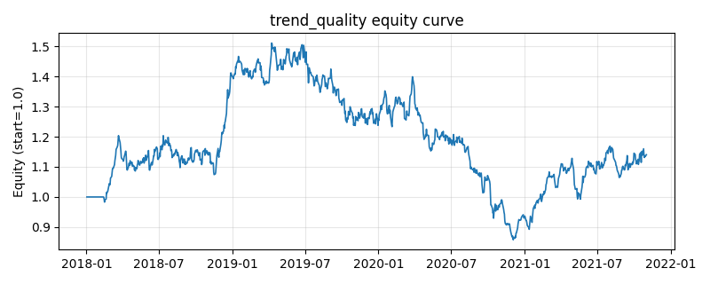

# 策略研究记录：trend_quality

> 类别/途径：**factor** ｜ 类型：cross_section ｜ 方向：只做多

## 一句话思路
趋势质量/价格效率：用净位移/路径长度（效率比）衡量趋势平滑度，做多效率最高的一篮子。

## 收集途径 / 灵感来源
因子异象——趋势质量/价格效率 (efficiency ratio)，纯价格构造。

## 核心假设
净位移占路径长度比例高，说明趋势由持续信息驱动而非噪声来回拉锯，动量更可信、回撤更小；做多『走得直』的资产可过滤假突破与震荡。在趋势末端发生反转，或市场进入高噪声状态时，效率比会失去 predictive 能力。

## 参数
- `window` = 30
- `top_frac` = 0.3333333333333333

## 实现要点
- 实现文件：`kairos_strategies/channels/factor.py`（类名对应本策略）。
- 输出统一为「目标权重面板」(date × asset)，由 `Backtester` 滞后一期执行，杜绝未来函数。
- 仅使用 numpy/pandas，离线、确定性。

## 数据与回测设置
| 项 | 值 |
|---|---|
| 数据集 | synthetic（8 资产） |
| 区间 | 2018-01-02 ~ 2021-11-01 |
| 期数 | 1000 |
| 年化基准期数 | 252 |
| 单边成本率 | 0.0500% |
| 无风险利率 | 0.00% |

## 回测结果
| 指标 | 值 |
|---|---|
| 累计收益 | 14.04% |
| 年化收益 (CAGR) | 3.37% |
| 年化波动 | 17.59% |
| 夏普 | 0.2761 |
| 索提诺 | 0.3896 |
| 最大回撤 | 43.24% |
| 卡玛 | 0.0778 |
| 胜率 | 50.93% |
| 盈利因子 | 1.0456 |
| 平均换手 | 0.4317 |
| 累计换手 | 431.72 |

## 净值曲线

## 结论与改进方向
- 结果为 **合成数据演示，用于验证实现正确性与 QR 流程**，不构成任何投资建议或收益承诺。
- 改进方向：在真实数据上重跑、参数敏感性分析、加入波动率目标/风控叠加、与其它策略做相关性分散。
