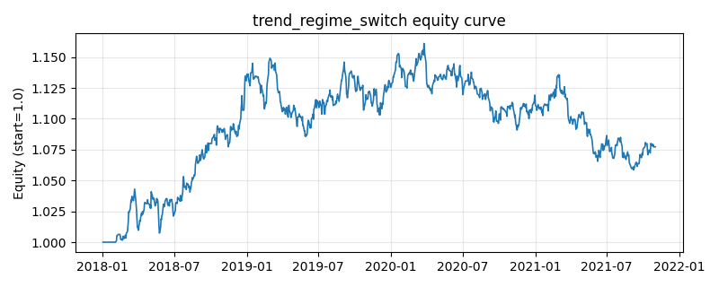

# 策略研究记录：trend_regime_switch

> 类别/途径：**regime** ｜ 类型：timing ｜ 方向：只做多

## 一句话思路
逐资产趋势/震荡状态切换：用效率比 ER（净位移/路径长度，平滑后过 er_on/er_off 双阈值滞后带状态机）判别『趋势 vs 震荡』——趋势期启用动量子逻辑（过去 mom_window 期收益为正则持有强势、为负则空仓），震荡期启用均值回归子逻辑（z-score < -entry_z 超跌买入，回归至 z > -exit_z 上方离场），两套子逻辑按状态硬切换，等预算 1/N。

## 收集途径 / 灵感来源
Kaufman 效率比 / 自适应市场假说 (MHM) 的『状态 × 子策略』切换范式实现，状态机、子逻辑组合与参数结构均为本仓库原创。

## 核心假设
核心假设（适应性市场假说）：动量与均值回归各自只在适配的市场性格下有效——动量在震荡市被反复打脸，回归在趋势市逆势接刀；ER 度量价格运动的方向纯度，能有效区分两种性格，按状态切换子逻辑可让每段子逻辑都工作在适配环境中。滞后带 + ER 平滑抑制状态抖动，控制切换换手。失效场景：趋势末端的 V 型反转（ER 滞后，状态切换晚于行情切换）、ER 长期处于两阈值之间的模糊资产、以及只做多约束下震荡子逻辑在单边阴跌初段仍会超跌买入（接刀一段后才由趋势态接管）。

## 参数
- `er_window` = 20
- `er_smooth` = 3
- `er_on` = 0.5
- `er_off` = 0.25
- `mom_window` = 20
- `z_window` = 24
- `entry_z` = 1.0
- `exit_z` = 0.0

## 实现要点
- 实现文件：`kairos_strategies/channels/regime.py`（类名对应本策略）。
- 输出统一为「目标权重面板」(date × asset)，由 `Backtester` 滞后一期执行，杜绝未来函数。
- 仅使用 numpy/pandas，离线、确定性。

## 数据与回测设置
| 项 | 值 |
|---|---|
| 数据集 | synthetic（8 资产） |
| 区间 | 2018-01-02 ~ 2021-11-01 |
| 期数 | 1000 |
| 年化基准期数 | 252 |
| 单边成本率 | 0.0500% |
| 无风险利率 | 0.00% |

## 回测结果
| 指标 | 值 |
|---|---|
| 累计收益 | 7.73% |
| 年化收益 (CAGR) | 1.89% |
| 年化波动 | 5.11% |
| 夏普 | 0.3927 |
| 索提诺 | 0.5756 |
| 最大回撤 | 8.83% |
| 卡玛 | 0.2145 |
| 胜率 | 50.57% |
| 盈利因子 | 1.0679 |
| 平均换手 | 0.0733 |
| 累计换手 | 73.33 |

## 净值曲线

## 结论与改进方向
- 结果为 **合成数据演示，用于验证实现正确性与 QR 流程**，不构成任何投资建议或收益承诺。
- 改进方向：在真实数据上重跑、参数敏感性分析、加入波动率目标/风控叠加、与其它策略做相关性分散。
