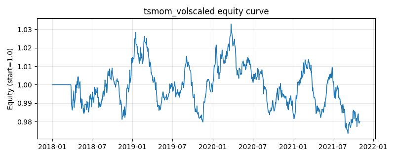

# 策略研究记录：tsmom_volscaled

> 类别/途径：**trend** ｜ 类型：timing ｜ 方向：只做多

## 一句话思路
时序动量 + 波动率目标：过去 N 期收益为正则做多（long_only），单资产仓位 = 等预算(1/N) × 趋势强度(mom/mom_ref 截断到[0,1]) × min(目标波动/已实现波动, 1)，趋势越强、波动越低则仓位越大，单资产上限=1/N，逐行和≤1。

## 收集途径 / 灵感来源
CTA 时序动量 (time-series momentum) + 波动率目标 (volatility targeting) 范式（本仓库原创实现）。

## 核心假设
核心假设：资产价格存在中期正自相关（趋势延续），且单位风险收益在低波动期更优。用过去 N 期收益符号做绝对动量过滤（只持有上涨资产），再用 目标波动/已实现波动 做风险预算，把每个资产的风险贡献拉平——同样涨幅下低波动更可能源于持续资金流而非噪声，故低波多配。趋势强度项让强趋势获得更大敞口、弱趋势小仓试探。失效场景：趋势急速反转(V 型)时动量滞后挨打；无方向宽幅震荡市中反复进出累积成本；目标波动远高于已实现波动时缩放触顶(=1/N)，退化为等预算持有。

## 参数
- `mom_window` = 60
- `mom_ref` = 0.1
- `vol_window` = 20
- `target_vol` = 0.15
- `vol_floor` = 0.02

## 实现要点
- 实现文件：`kairos_strategies/channels/trend.py`（类名对应本策略）。
- 输出统一为「目标权重面板」(date × asset)，由 `Backtester` 滞后一期执行，杜绝未来函数。
- 仅使用 numpy/pandas，离线、确定性。

## 数据与回测设置
| 项 | 值 |
|---|---|
| 数据集 | synthetic（8 资产） |
| 区间 | 2018-01-02 ~ 2021-11-01 |
| 期数 | 1000 |
| 年化基准期数 | 252 |
| 单边成本率 | 0.0500% |
| 无风险利率 | 0.00% |

## 回测结果
| 指标 | 值 |
|---|---|
| 累计收益 | -2.00% |
| 年化收益 (CAGR) | -0.51% |
| 年化波动 | 3.22% |
| 夏普 | -0.1419 |
| 索提诺 | -0.1993 |
| 最大回撤 | 5.74% |
| 卡玛 | -0.0884 |
| 胜率 | 49.57% |
| 盈利因子 | 0.9766 |
| 平均换手 | 0.0373 |
| 累计换手 | 37.29 |

## 净值曲线

## 结论与改进方向
- 结果为 **合成数据演示，用于验证实现正确性与 QR 流程**，不构成任何投资建议或收益承诺。
- 改进方向：在真实数据上重跑、参数敏感性分析、加入波动率目标/风控叠加、与其它策略做相关性分散。
