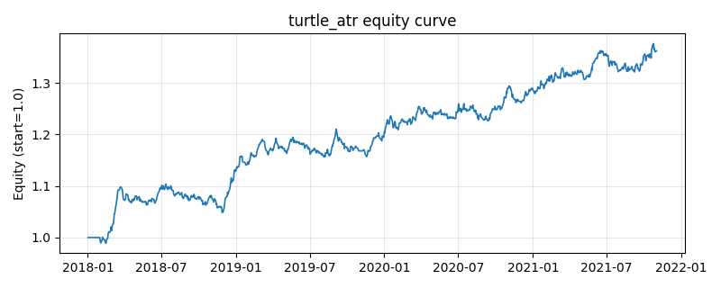

# 策略研究记录：turtle_atr

> 类别/途径：**trend** ｜ 类型：timing ｜ 方向：只做多

## 一句话思路
海龟 + ATR 仓位：唐奇安通道突破入场(收盘创 N 日新高做多、跌破 M 日新低离场，通道 shift(1) 防未来，状态机持有)，每资产仓位 = 等预算(1/N) × 持有(0/1) × min(risk_target/(ATR/价格), 1)，即按 ATR 占价比反比缩放——波动大仓位小、波动小仓位大，单资产上限=1/N，逐行和≤1。

## 收集途径 / 灵感来源
经典 CTA——海龟交易法 (唐奇安突破) + ATR 波动率仓位管理（本仓库原创实现）。

## 核心假设
核心假设：区间突破后趋势倾向延续(海龟交易法则)，而每笔头寸的风险应由波动决定——用 ATR 占价比作分母做反比缩放(等价于每资产等风险预算)，可在高波动资产上自动减仓、低波动资产上加仓，平滑组合风险、抑制单一名义敞口主导。入场/离场用不同长度通道(进 N 出 M)形成滞后带降低 whipsaw。失效场景：震荡市中突破频繁失败造成连续小亏(靠偶发大趋势回本)；ATR 收盘价近似系统性低估含日内振幅的波动；risk_target 设置过高会让多数资产仓位触顶(=1/N)而丧失波动率区分度。

## 参数
- `entry` = 20
- `exit` = 10
- `atr_window` = 14
- `risk_target` = 0.02
- `atr_floor_pct` = 0.001

## 实现要点
- 实现文件：`kairos_strategies/channels/trend.py`（类名对应本策略）。
- 输出统一为「目标权重面板」(date × asset)，由 `Backtester` 滞后一期执行，杜绝未来函数。
- 仅使用 numpy/pandas，离线、确定性。

## 数据与回测设置
| 项 | 值 |
|---|---|
| 数据集 | synthetic（8 资产） |
| 区间 | 2018-01-02 ~ 2021-11-01 |
| 期数 | 1000 |
| 年化基准期数 | 252 |
| 单边成本率 | 0.0500% |
| 无风险利率 | 0.00% |

## 回测结果
| 指标 | 值 |
|---|---|
| 累计收益 | 36.21% |
| 年化收益 (CAGR) | 8.10% |
| 年化波动 | 5.33% |
| 夏普 | 1.4886 |
| 索提诺 | 2.3166 |
| 最大回撤 | 5.02% |
| 卡玛 | 1.6130 |
| 胜率 | 51.95% |
| 盈利因子 | 1.2761 |
| 平均换手 | 0.0464 |
| 累计换手 | 46.37 |

## 净值曲线

## 结论与改进方向
- 结果为 **合成数据演示，用于验证实现正确性与 QR 流程**，不构成任何投资建议或收益承诺。
- 改进方向：在真实数据上重跑、参数敏感性分析、加入波动率目标/风控叠加、与其它策略做相关性分散。
