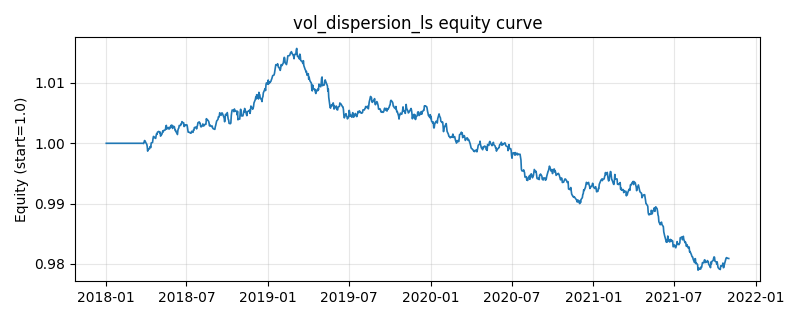

# 策略研究记录：vol_dispersion_ls

> 类别/途径：**dispersion** ｜ 类型：cross_section ｜ 方向：可多空

## 一句话思路
波动率分散度多空代理：每条腿各占 leg_budget=0.5 预算——做空『等权指数篮子』（每资产 −0.5/N，其波动含分散化收益、系统性同步成分被短路），做多『逆波动加权的单腿分散篮子』（+0.5×ivw_i，低波动资产权重更高，代表可分散的个体风险敞口）；仓位规模 s ∈ [0,1] 由波动率分散度比率 D = 平均单股已实现波动 / 等权指数已实现波动 门控：D ≥ size_hi（单股波动远高于指数波动 = 高分散，分散化收益丰厚）满强度，D ≤ size_lo（同步，分散度消失）平仓；净权重 = s×0.5×(ivw_i − 1/N)，行和 ≈ 0（美元中性）、绝对值和 ≤ 1，预热期空仓。

## 收集途径 / 灵感来源
指数波动 vs 单股波动分散度交易 (index-vol / single-stock-vol dispersion trade) 的日频纯价格线性代理；『逆波动分散篮子 vs 等权指数篮子』的双腿构造与 D 比率门控为本仓库原创实现，与 statarb 渠道（错价回归型多空）、long_short 渠道（因子排序型多空）的信号来源均不同。

## 核心假设
核心假设（dispersion trading 的日频线性代理）：经典的分散度交易做多单股波动、做空指数波动，其收益来源是『单股已实现方差 − 指数已实现方差』即波动率分散度溢价——指数波动因相关性分散化而系统性低于平均单股波动，卖出指数波动/买入单股波动等于收割这一结构性差价。纯价格线性持仓无法复制期权的方差凸性，本策略用『逆波动多头篮子 vs 等权指数空头』的市场中性 book 作代理：多腿按 1/σ 加权把预算集中在个体风险上、空腿均匀短路同步成分，且仅当 D = σ_单股均值/σ_指数 确认高分散状态（单股波动远高于指数波动）时才开仓——此时截面个体波动主导、篮子间价差的信息含量最高；相关性趋近 1 时 D → 1，分散化收益消失，自动平仓。失效场景：线性代理赚的实际是『低波动腿相对高波动腿』的截面差价，当高波动资产领涨（投机性逼空、垃圾股暴动）时持续亏损；D 的绝对锚点在天然低相关的 universe（D 恒高）上退化为常开的低波动多空 book；波动率估计窗口滞后于分散度状态的突然塌缩。

## 参数
- `vol_window` = 60
- `vol_floor` = 0.01
- `size_lo` = 1.1
- `size_hi` = 1.6
- `leg_budget` = 0.5

## 实现要点
- 实现文件：`kairos_strategies/channels/dispersion.py`（类名对应本策略）。
- 输出统一为「目标权重面板」(date × asset)，由 `Backtester` 滞后一期执行，杜绝未来函数。
- 仅使用 numpy/pandas，离线、确定性。

## 数据与回测设置
| 项 | 值 |
|---|---|
| 数据集 | synthetic（8 资产） |
| 区间 | 2018-01-02 ~ 2021-11-01 |
| 期数 | 1000 |
| 年化基准期数 | 252 |
| 单边成本率 | 0.0500% |
| 无风险利率 | 0.00% |

## 回测结果
| 指标 | 值 |
|---|---|
| 累计收益 | -1.91% |
| 年化收益 (CAGR) | -0.48% |
| 年化波动 | 0.64% |
| 夏普 | -0.7551 |
| 索提诺 | -1.0161 |
| 最大回撤 | 3.62% |
| 卡玛 | -0.1339 |
| 胜率 | 48.51% |
| 盈利因子 | 0.8832 |
| 平均换手 | 0.0054 |
| 累计换手 | 5.39 |

## 净值曲线

## 结论与改进方向
- 结果为 **合成数据演示，用于验证实现正确性与 QR 流程**，不构成任何投资建议或收益承诺。
- 改进方向：在真实数据上重跑、参数敏感性分析、加入波动率目标/风控叠加、与其它策略做相关性分散。
